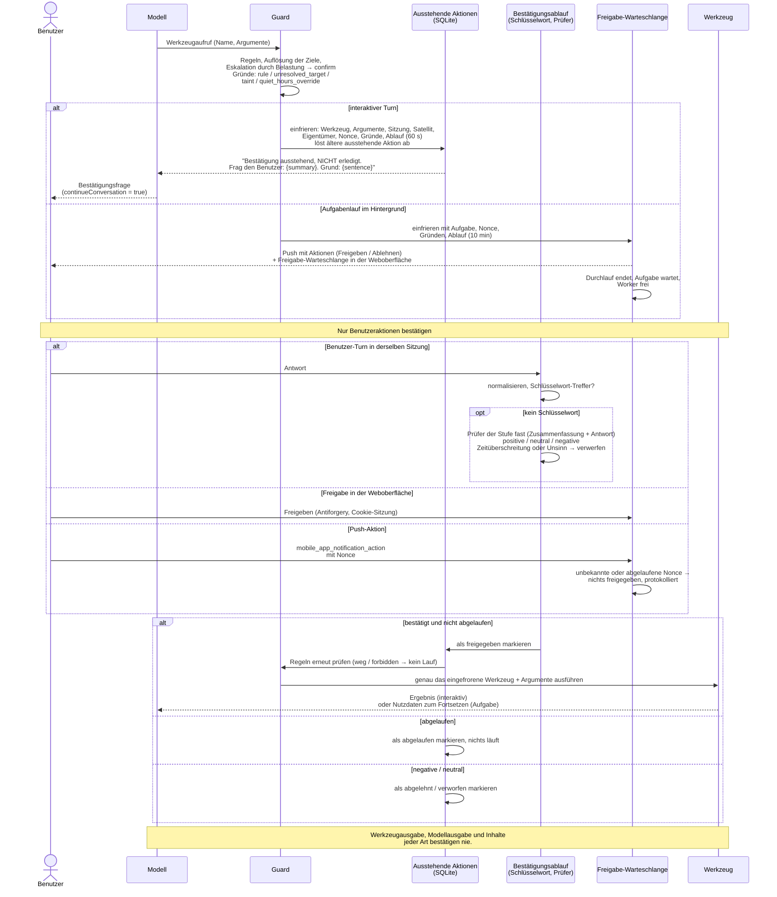

```mermaid
%% Marshal: Ablauf einer Aktion der Bestätigungsstufe (deutsche Fassung von confirm-tier-action.md)
%% KEEP UP TO DATE: must match the guard, pending action store, confirmation flow and approval queue (risk-guard and
%% approval-queue specs). Update it together with confirm-tier-action.md in the same change (see docs/diagrams/README.md).
sequenceDiagram
    actor User as Benutzer
    participant Model as Modell
    participant Guard
    participant Store as Ausstehende Aktionen<br/>(SQLite)
    participant Flow as Bestätigungsablauf<br/>(Schlüsselwort, Prüfer)
    participant Queue as Freigabe-Warteschlange
    participant Tool as Werkzeug

    Model->>Guard: Werkzeugaufruf (Name, Argumente)
    Guard->>Guard: Regeln, Auflösung der Ziele,<br/>Eskalation durch Belastung → confirm<br/>Gründe: rule / unresolved_target /<br/>taint / quiet_hours_override

    alt interaktiver Turn
        Guard->>Store: einfrieren: Werkzeug, Argumente, Sitzung, Satellit,<br/>Eigentümer, Nonce, Gründe, Ablauf (60 s)<br/>löst ältere ausstehende Aktion ab
        Store-->>Model: "Bestätigung ausstehend, NICHT erledigt.<br/>Frag den Benutzer: {summary}. Grund: {sentence}"
        Model-->>User: Bestätigungsfrage<br/>(continueConversation = true)
    else Aufgabenlauf im Hintergrund
        Guard->>Queue: einfrieren mit Aufgabe, Nonce,<br/>Gründen, Ablauf (10 min)
        Queue-->>User: Push mit Aktionen (Freigeben / Ablehnen)<br/>+ Freigabe-Warteschlange in der Weboberfläche
        Queue->>Queue: Durchlauf endet, Aufgabe wartet,<br/>Worker frei
    end

    Note over User,Tool: Nur Benutzeraktionen bestätigen

    alt Benutzer-Turn in derselben Sitzung
        User->>Flow: Antwort
        Flow->>Flow: normalisieren, Schlüsselwort-Treffer?
        opt kein Schlüsselwort
            Flow->>Flow: Prüfer der Stufe fast (Zusammenfassung + Antwort)<br/>positive / neutral / negative<br/>Zeitüberschreitung oder Unsinn → verwerfen
        end
    else Freigabe in der Weboberfläche
        User->>Queue: Freigeben (Antiforgery, Cookie-Sitzung)
    else Push-Aktion
        User->>Queue: mobile_app_notification_action<br/>mit Nonce
        Queue->>Queue: unbekannte oder abgelaufene Nonce →<br/>nichts freigegeben, protokolliert
    end

    alt bestätigt und nicht abgelaufen
        Flow->>Store: als freigegeben markieren
        Store->>Guard: Regeln erneut prüfen (weg / forbidden → kein Lauf)
        Guard->>Tool: genau das eingefrorene Werkzeug + Argumente ausführen
        Tool-->>Model: Ergebnis (interaktiv)<br/>oder Nutzdaten zum Fortsetzen (Aufgabe)
    else abgelaufen
        Store->>Store: als abgelaufen markieren, nichts läuft
    else negative / neutral
        Store->>Store: als abgelehnt / verworfen markieren
    end

    Note over Model,Tool: Werkzeugausgabe, Modellausgabe und Inhalte<br/>jeder Art bestätigen nie.
```
