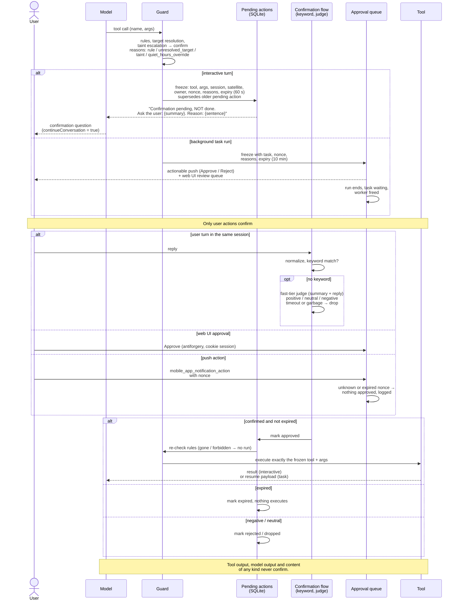

```mermaid
%% Marshal: confirm-tier action flow
%% KEEP UP TO DATE: must match the guard, pending action store, confirmation flow and approval queue (risk-guard and
%% approval-queue specs). Update it in the same change that alters them (see docs/diagrams/README.md).
sequenceDiagram
    actor User
    participant Model
    participant Guard
    participant Store as Pending actions<br/>(SQLite)
    participant Flow as Confirmation flow<br/>(keyword, judge)
    participant Queue as Approval queue
    participant Tool

    Model->>Guard: tool call (name, args)
    Guard->>Guard: rules, target resolution,<br/>taint escalation → confirm<br/>reasons: rule / unresolved_target /<br/>taint / quiet_hours_override

    alt interactive turn
        Guard->>Store: freeze: tool, args, session, satellite,<br/>owner, nonce, reasons, expiry (60 s)<br/>supersedes older pending action
        Store-->>Model: "Confirmation pending, NOT done.<br/>Ask the user: {summary}. Reason: {sentence}"
        Model-->>User: confirmation question<br/>(continueConversation = true)
    else background task run
        Guard->>Queue: freeze with task, nonce,<br/>reasons, expiry (10 min)
        Queue-->>User: actionable push (Approve / Reject)<br/>+ web UI review queue
        Queue->>Queue: run ends, task waiting,<br/>worker freed
    end

    Note over User,Tool: Only user actions confirm

    alt user turn in the same session
        User->>Flow: reply
        Flow->>Flow: normalize, keyword match?
        opt no keyword
            Flow->>Flow: fast-tier judge (summary + reply)<br/>positive / neutral / negative<br/>timeout or garbage → drop
        end
    else web UI approval
        User->>Queue: Approve (antiforgery, cookie session)
    else push action
        User->>Queue: mobile_app_notification_action<br/>with nonce
        Queue->>Queue: unknown or expired nonce →<br/>nothing approved, logged
    end

    alt confirmed and not expired
        Flow->>Store: mark approved
        Store->>Guard: re-check rules (gone / forbidden → no run)
        Guard->>Tool: execute exactly the frozen tool + args
        Tool-->>Model: result (interactive)<br/>or resume payload (task)
    else expired
        Store->>Store: mark expired, nothing executes
    else negative / neutral
        Store->>Store: mark rejected / dropped
    end

    Note over Model,Tool: Tool output, model output and content<br/>of any kind never confirm.
```
