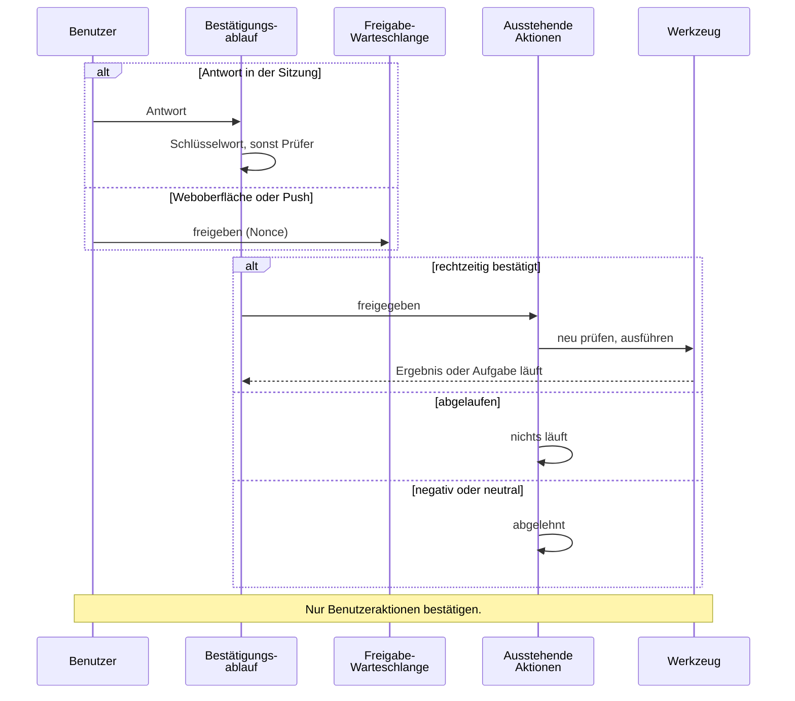

```mermaid
sequenceDiagram
%% Marshal: Aktion der Bestätigungsstufe, Bestätigen (deutsche Fassung von confirm-tier-confirm.md)
%% KEEP UP TO DATE: must match the confirmation flow, pending action store and approval queue (risk-guard and
%% approval-queue specs). Update it together with confirm-tier-confirm.md in the same change (see
%% docs/diagrams/README.md).
%% Keep every message on one short line: the site draws sequence diagrams at build time, and multi-line labels overlap.
    participant User as Benutzer
    participant Flow as Bestätigungs-<br/>ablauf
    participant Queue as Freigabe-<br/>Warteschlange
    participant Store as Ausstehende<br/>Aktionen
    participant Tool as Werkzeug

    alt Antwort in der Sitzung
        User->>Flow: Antwort
        Flow->>Flow: Schlüsselwort, sonst Prüfer
    else Weboberfläche oder Push
        User->>Queue: freigeben (Nonce)
    end
    alt rechtzeitig bestätigt
        Flow->>Store: freigegeben
        Store->>Tool: neu prüfen, ausführen
        Tool-->>Flow: Ergebnis oder Aufgabe läuft
    else abgelaufen
        Store->>Store: nichts läuft
    else negativ oder neutral
        Store->>Store: abgelehnt
    end
    Note over User,Tool: Nur Benutzeraktionen bestätigen.
```
