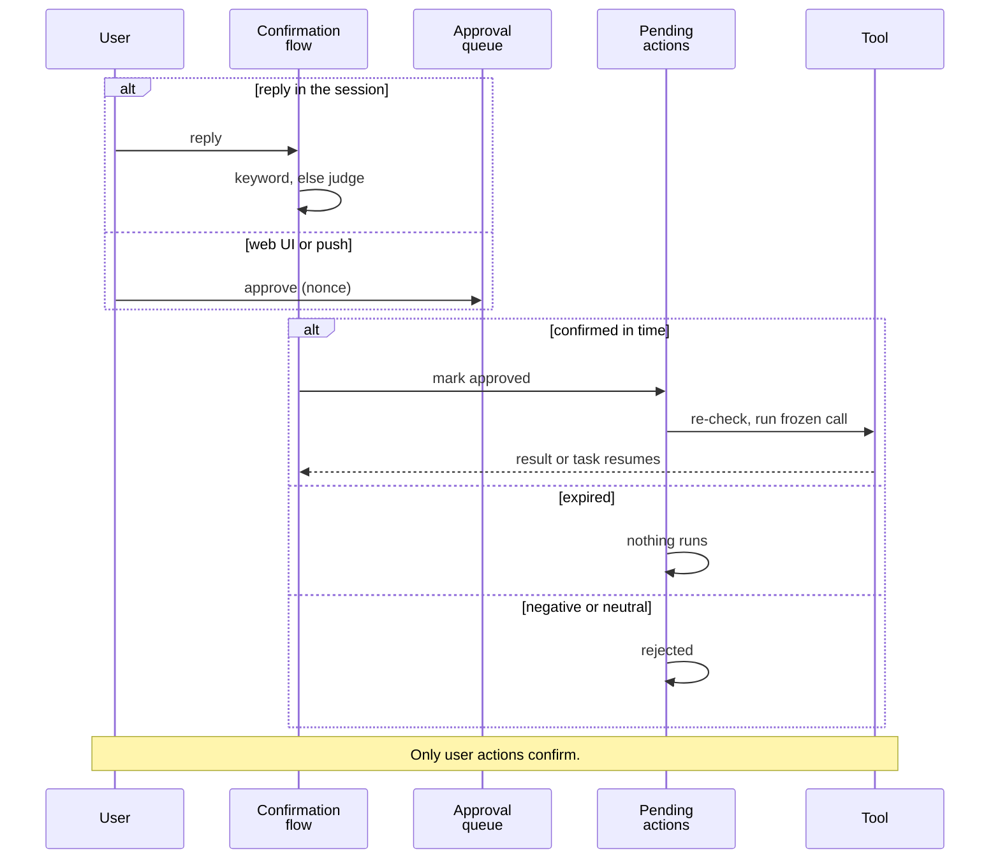

```mermaid
sequenceDiagram
%% Marshal: confirm-tier action, confirming
%% KEEP UP TO DATE: must match the confirmation flow, pending action store and approval queue (risk-guard and
%% approval-queue specs). Update it together with confirm-tier-confirm.de.md in the same change (see
%% docs/diagrams/README.md).
%% Keep every message on one short line: the site draws sequence diagrams at build time, and multi-line labels overlap.
    participant User
    participant Flow as Confirmation<br/>flow
    participant Queue as Approval<br/>queue
    participant Store as Pending<br/>actions
    participant Tool

    alt reply in the session
        User->>Flow: reply
        Flow->>Flow: keyword, else judge
    else web UI or push
        User->>Queue: approve (nonce)
    end
    alt confirmed in time
        Flow->>Store: mark approved
        Store->>Tool: re-check, run frozen call
        Tool-->>Flow: result or task resumes
    else expired
        Store->>Store: nothing runs
    else negative or neutral
        Store->>Store: rejected
    end
    Note over User,Tool: Only user actions confirm.
```
