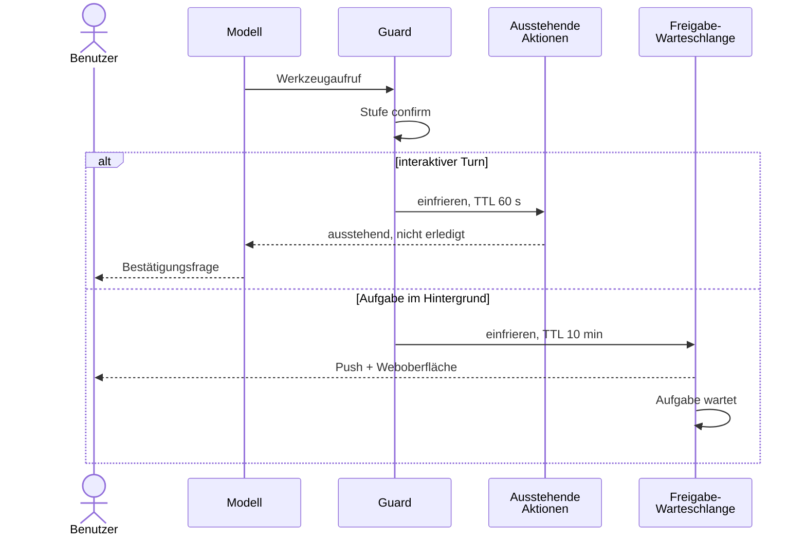

```mermaid
sequenceDiagram
%% Marshal: Aktion der Bestätigungsstufe, Einfrieren (deutsche Fassung von confirm-tier-freeze.md)
%% KEEP UP TO DATE: must match the guard, pending action store and approval queue (risk-guard and approval-queue
%% specs). Update it together with confirm-tier-freeze.md in the same change (see docs/diagrams/README.md).
%% Keep every message on one short line: the site draws sequence diagrams at build time, and multi-line labels overlap.
    actor User as Benutzer
    participant Model as Modell
    participant Guard
    participant Store as Ausstehende<br/>Aktionen
    participant Queue as Freigabe-<br/>Warteschlange

    Model->>Guard: Werkzeugaufruf
    Guard->>Guard: Stufe confirm
    alt interaktiver Turn
        Guard->>Store: einfrieren, TTL 60 s
        Store-->>Model: ausstehend, nicht erledigt
        Model-->>User: Bestätigungsfrage
    else Aufgabe im Hintergrund
        Guard->>Queue: einfrieren, TTL 10 min
        Queue-->>User: Push + Weboberfläche
        Queue->>Queue: Aufgabe wartet
    end
```
