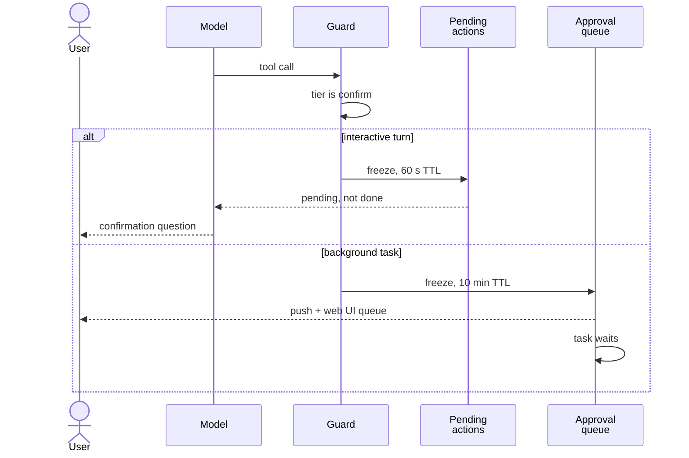

```mermaid
sequenceDiagram
%% Marshal: confirm-tier action, freezing
%% KEEP UP TO DATE: must match the guard, pending action store and approval queue (risk-guard and approval-queue
%% specs). Update it together with confirm-tier-freeze.de.md in the same change (see docs/diagrams/README.md).
%% Keep every message on one short line: the site draws sequence diagrams at build time, and multi-line labels overlap.
    actor User
    participant Model
    participant Guard
    participant Store as Pending<br/>actions
    participant Queue as Approval<br/>queue

    Model->>Guard: tool call
    Guard->>Guard: tier is confirm
    alt interactive turn
        Guard->>Store: freeze, 60 s TTL
        Store-->>Model: pending, not done
        Model-->>User: confirmation question
    else background task
        Guard->>Queue: freeze, 10 min TTL
        Queue-->>User: push + web UI queue
        Queue->>Queue: task waits
    end
```
