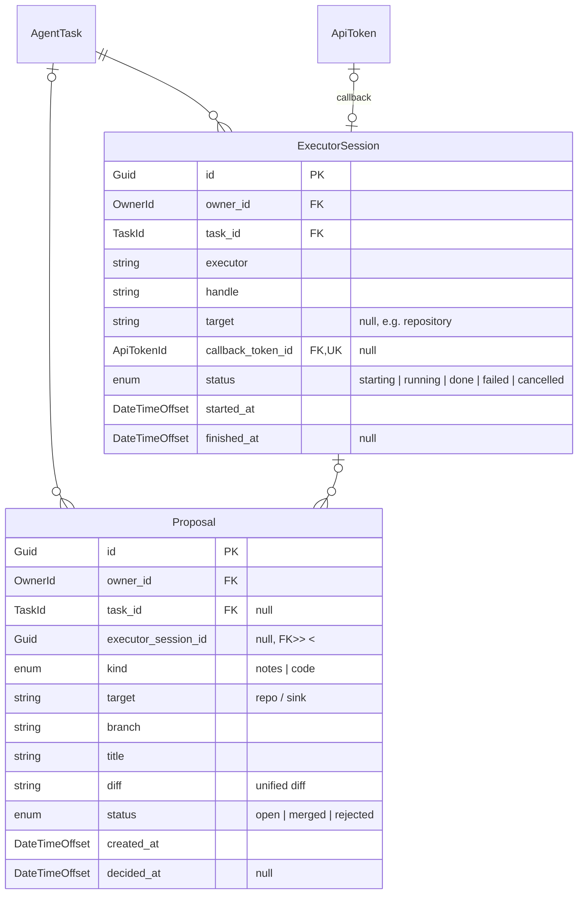

```mermaid
erDiagram
%% KEEP UP TO DATE: must match the EF Core model in src/ (Marshal.Data). Update it in the same change that adds,
%% removes or renames an entity, column or relationship (see docs/diagrams/README.md).
%% Owner edges (owner_id to User) are not drawn. A relationship is drawn in the diagram of the entity that holds the key.
    ExecutorSession {
        Guid id PK
        OwnerId owner_id FK
        TaskId task_id FK
        string executor
        string handle
        string target "null, e.g. repository"
        ApiTokenId callback_token_id FK,UK "null"
        enum status "starting | running | done | failed | cancelled"
        DateTimeOffset started_at
        DateTimeOffset finished_at "null"
    }
    Proposal {
        Guid id PK
        OwnerId owner_id FK
        TaskId task_id FK "null"
        Guid executor_session_id "null, FK>>  <<merge / discard go through its executor"
        enum kind "notes | code"
        string target "repo / sink"
        string branch
        string title
        string diff "unified diff"
        enum status "open | merged | rejected"
        DateTimeOffset created_at
        DateTimeOffset decided_at "null"
    }
    AgentTask ||--o{ ExecutorSession : ""
    AgentTask |o--o{ Proposal : ""
    ExecutorSession |o--o{ Proposal : ""
    ApiToken |o--o| ExecutorSession : "callback"
```
