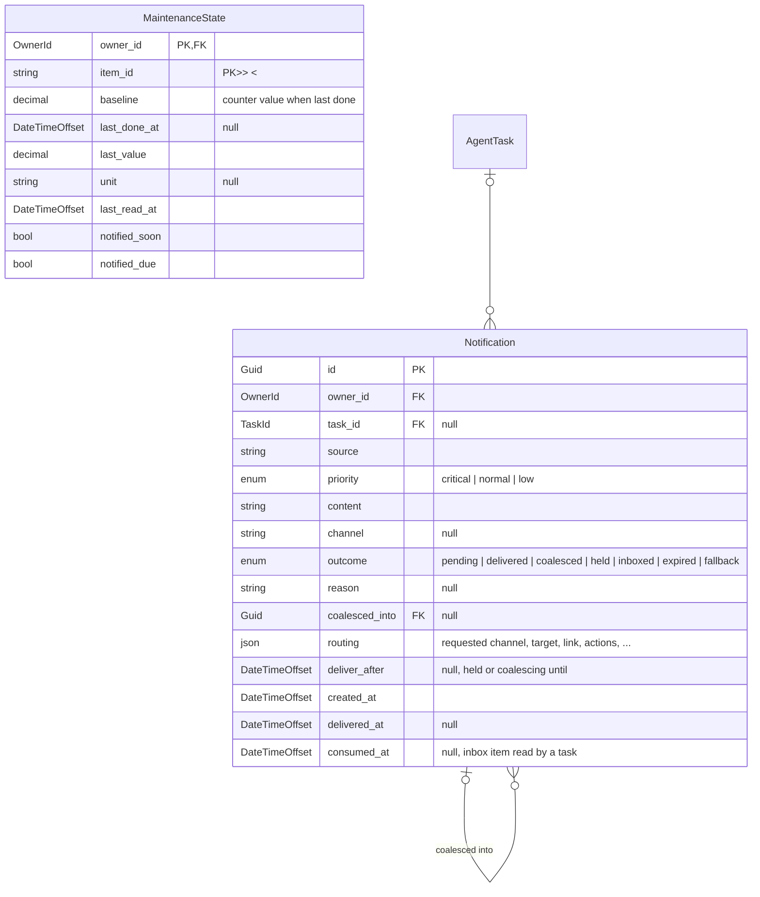

```mermaid
erDiagram
%% KEEP UP TO DATE: must match the EF Core model in src/ (Marshal.Data). Update it in the same change that adds,
%% removes or renames an entity, column or relationship (see docs/diagrams/README.md).
%% Owner edges (owner_id to User) are not drawn. A relationship is drawn in the diagram of the entity that holds the key.
    Notification {
        Guid id PK
        OwnerId owner_id FK
        TaskId task_id FK "null"
        string source
        enum priority "critical | normal | low"
        string content
        string channel "null"
        enum outcome "pending | delivered | coalesced | held | inboxed | expired | fallback"
        string reason "null"
        Guid coalesced_into FK "null"
        json routing "requested channel, target, link, actions, ..."
        DateTimeOffset deliver_after "null, held or coalescing until"
        DateTimeOffset created_at
        DateTimeOffset delivered_at "null"
        DateTimeOffset consumed_at "null, inbox item read by a task"
    }
    MaintenanceState {
        OwnerId owner_id PK,FK
        string item_id "PK>>  <<maintenance.items key"
        decimal baseline "counter value when last done"
        DateTimeOffset last_done_at "null"
        decimal last_value
        string unit "null"
        DateTimeOffset last_read_at
        bool notified_soon
        bool notified_due
    }
    AgentTask |o--o{ Notification : ""
    Notification |o--o{ Notification : "coalesced into"
```
