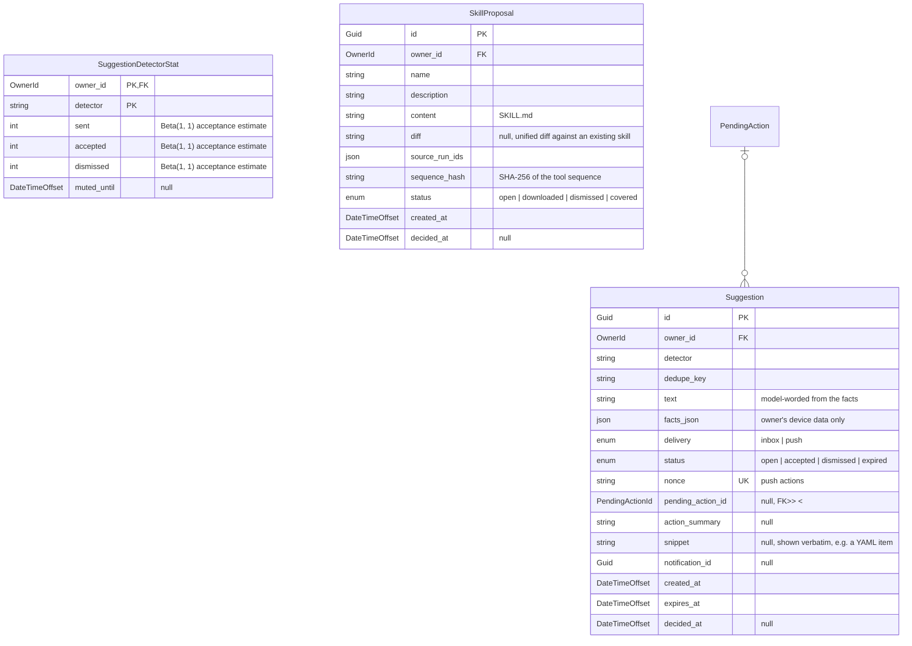

```mermaid
erDiagram
%% KEEP UP TO DATE: must match the EF Core model in src/ (Marshal.Data). Update it in the same change that adds,
%% removes or renames an entity, column or relationship (see docs/diagrams/README.md).
%% Owner edges (owner_id to User) are not drawn. A relationship is drawn in the diagram of the entity that holds the key.
    Suggestion {
        Guid id PK
        OwnerId owner_id FK
        string detector
        string dedupe_key
        string text "model-worded from the facts"
        json facts_json "owner's device data only"
        enum delivery "inbox | push"
        enum status "open | accepted | dismissed | expired"
        string nonce UK "push actions"
        PendingActionId pending_action_id "null, FK>>  <<frozen proposed action"
        string action_summary "null"
        string snippet "null, shown verbatim, e.g. a YAML item"
        Guid notification_id "null"
        DateTimeOffset created_at
        DateTimeOffset expires_at
        DateTimeOffset decided_at "null"
    }
    SuggestionDetectorStat {
        OwnerId owner_id PK,FK
        string detector PK
        int sent "Beta(1, 1) acceptance estimate"
        int accepted "Beta(1, 1) acceptance estimate"
        int dismissed "Beta(1, 1) acceptance estimate"
        DateTimeOffset muted_until "null"
    }
    SkillProposal {
        Guid id PK
        OwnerId owner_id FK
        string name
        string description
        string content "SKILL.md"
        string diff "null, unified diff against an existing skill"
        json source_run_ids
        string sequence_hash "SHA-256 of the tool sequence"
        enum status "open | downloaded | dismissed | covered"
        DateTimeOffset created_at
        DateTimeOffset decided_at "null"
    }
    PendingAction |o--o{ Suggestion : ""
```
