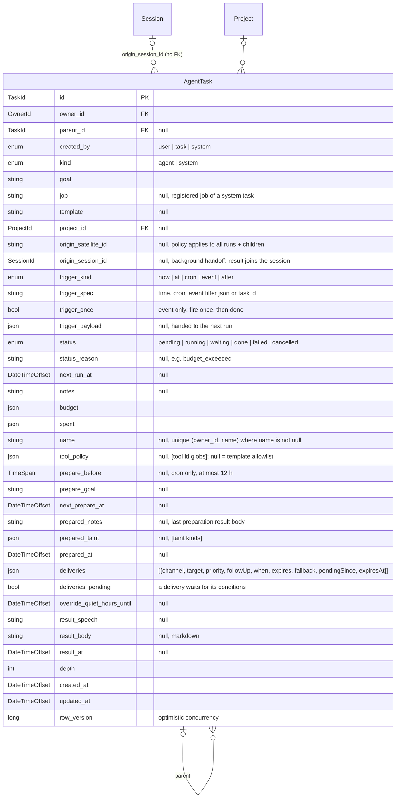

```mermaid
erDiagram
%% KEEP UP TO DATE: must match the EF Core model in src/ (Marshal.Data). Update it in the same change that adds,
%% removes or renames an entity, column or relationship (see docs/diagrams/README.md).
%% Owner edges (owner_id to User) are not drawn. A relationship is drawn in the diagram of the entity that holds the key.
    AgentTask {
        TaskId id PK
        OwnerId owner_id FK
        TaskId parent_id FK "null"
        enum created_by "user | task | system"
        enum kind "agent | system"
        string goal
        string job "null, registered job of a system task"
        string template "null"
        ProjectId project_id FK "null"
        string origin_satellite_id "null, policy applies to all runs + children"
        SessionId origin_session_id "null, background handoff: result joins the session"
        enum trigger_kind "now | at | cron | event | after"
        string trigger_spec "time, cron, event filter json or task id"
        bool trigger_once "event only: fire once, then done"
        json trigger_payload "null, handed to the next run"
        enum status "pending | running | waiting | done | failed | cancelled"
        string status_reason "null, e.g. budget_exceeded"
        DateTimeOffset next_run_at "null"
        string notes "null"
        json budget
        json spent
        string name "null, unique (owner_id, name) where name is not null"
        json tool_policy "null, [tool id globs]; null = template allowlist"
        TimeSpan prepare_before "null, cron only, at most 12 h"
        string prepare_goal "null"
        DateTimeOffset next_prepare_at "null"
        string prepared_notes "null, last preparation result body"
        json prepared_taint "null, [taint kinds]"
        DateTimeOffset prepared_at "null"
        json deliveries "[{channel, target, priority, followUp, when, expires, fallback, pendingSince, expiresAt}]"
        bool deliveries_pending "a delivery waits for its conditions"
        DateTimeOffset override_quiet_hours_until "null"
        string result_speech "null"
        string result_body "null, markdown"
        DateTimeOffset result_at "null"
        int depth
        DateTimeOffset created_at
        DateTimeOffset updated_at
        long row_version "optimistic concurrency"
    }
    Session |o..o{ AgentTask : "origin_session_id (no FK)"
    Project |o--o{ AgentTask : ""
    AgentTask |o--o{ AgentTask : "parent"
```
