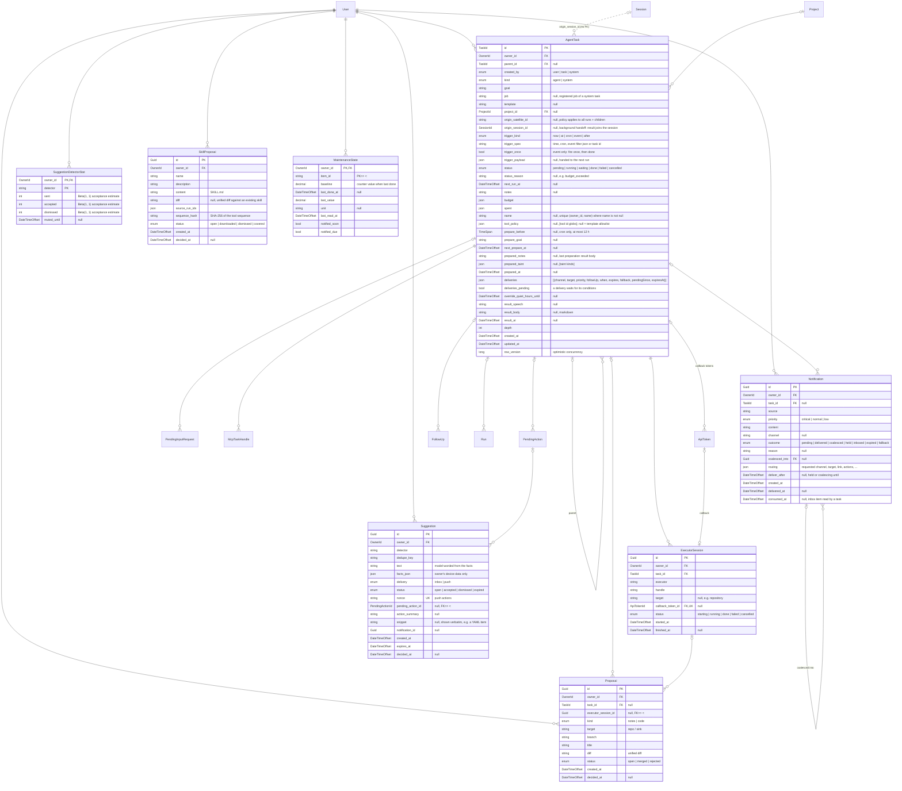

```mermaid
erDiagram
%% KEEP UP TO DATE: must match the EF Core model in src/ (Marshal.Data). Update it in the same change that adds,
%% removes or renames an entity, column or relationship (see docs/diagrams/README.md).
    AgentTask {
        TaskId id PK
        OwnerId owner_id FK
        TaskId parent_id FK "null"
        enum created_by "user | task | system"
        enum kind "agent | system"
        string goal
        string job "null, registered job of a system task"
        string template "null"
        ProjectId project_id FK "null"
        string origin_satellite_id "null, policy applies to all runs + children"
        SessionId origin_session_id "null, background handoff: result joins the session"
        enum trigger_kind "now | at | cron | event | after"
        string trigger_spec "time, cron, event filter json or task id"
        bool trigger_once "event only: fire once, then done"
        json trigger_payload "null, handed to the next run"
        enum status "pending | running | waiting | done | failed | cancelled"
        string status_reason "null, e.g. budget_exceeded"
        DateTimeOffset next_run_at "null"
        string notes "null"
        json budget
        json spent
        string name "null, unique (owner_id, name) where name is not null"
        json tool_policy "null, [tool id globs]; null = template allowlist"
        TimeSpan prepare_before "null, cron only, at most 12 h"
        string prepare_goal "null"
        DateTimeOffset next_prepare_at "null"
        string prepared_notes "null, last preparation result body"
        json prepared_taint "null, [taint kinds]"
        DateTimeOffset prepared_at "null"
        json deliveries "[{channel, target, priority, followUp, when, expires, fallback, pendingSince, expiresAt}]"
        bool deliveries_pending "a delivery waits for its conditions"
        DateTimeOffset override_quiet_hours_until "null"
        string result_speech "null"
        string result_body "null, markdown"
        DateTimeOffset result_at "null"
        int depth
        DateTimeOffset created_at
        DateTimeOffset updated_at
        long row_version "optimistic concurrency"
    }
    ExecutorSession {
        Guid id PK
        OwnerId owner_id FK
        TaskId task_id FK
        string executor
        string handle
        string target "null, e.g. repository"
        ApiTokenId callback_token_id FK,UK "null"
        enum status "starting | running | done | failed | cancelled"
        DateTimeOffset started_at
        DateTimeOffset finished_at "null"
    }
    Notification {
        Guid id PK
        OwnerId owner_id FK
        TaskId task_id FK "null"
        string source
        enum priority "critical | normal | low"
        string content
        string channel "null"
        enum outcome "pending | delivered | coalesced | held | inboxed | expired | fallback"
        string reason "null"
        Guid coalesced_into FK "null"
        json routing "requested channel, target, link, actions, ..."
        DateTimeOffset deliver_after "null, held or coalescing until"
        DateTimeOffset created_at
        DateTimeOffset delivered_at "null"
        DateTimeOffset consumed_at "null, inbox item read by a task"
    }
    Proposal {
        Guid id PK
        OwnerId owner_id FK
        TaskId task_id FK "null"
        Guid executor_session_id "null, FK>>  <<merge / discard go through its executor"
        enum kind "notes | code"
        string target "repo / sink"
        string branch
        string title
        string diff "unified diff"
        enum status "open | merged | rejected"
        DateTimeOffset created_at
        DateTimeOffset decided_at "null"
    }
    Suggestion {
        Guid id PK
        OwnerId owner_id FK
        string detector
        string dedupe_key
        string text "model-worded from the facts"
        json facts_json "owner's device data only"
        enum delivery "inbox | push"
        enum status "open | accepted | dismissed | expired"
        string nonce UK "push actions"
        PendingActionId pending_action_id "null, FK>>  <<frozen proposed action"
        string action_summary "null"
        string snippet "null, shown verbatim, e.g. a YAML item"
        Guid notification_id "null"
        DateTimeOffset created_at
        DateTimeOffset expires_at
        DateTimeOffset decided_at "null"
    }
    SuggestionDetectorStat {
        OwnerId owner_id PK,FK
        string detector PK
        int sent "Beta(1, 1) acceptance estimate"
        int accepted "Beta(1, 1) acceptance estimate"
        int dismissed "Beta(1, 1) acceptance estimate"
        DateTimeOffset muted_until "null"
    }
    SkillProposal {
        Guid id PK
        OwnerId owner_id FK
        string name
        string description
        string content "SKILL.md"
        string diff "null, unified diff against an existing skill"
        json source_run_ids
        string sequence_hash "SHA-256 of the tool sequence"
        enum status "open | downloaded | dismissed | covered"
        DateTimeOffset created_at
        DateTimeOffset decided_at "null"
    }
    MaintenanceState {
        OwnerId owner_id PK,FK
        string item_id "PK>>  <<maintenance.items key"
        decimal baseline "counter value when last done"
        DateTimeOffset last_done_at "null"
        decimal last_value
        string unit "null"
        DateTimeOffset last_read_at
        bool notified_soon
        bool notified_due
    }
    AgentTask |o--o{ PendingInputRequest : ""
    AgentTask ||--o{ McpTaskHandle : ""
    User ||--o{ AgentTask : ""
    User ||--o{ Notification : ""
    User ||--o{ Proposal : ""
    User ||--o{ Suggestion : ""
    User ||--o{ SuggestionDetectorStat : ""
    User ||--o{ SkillProposal : ""
    User ||--o{ MaintenanceState : ""
    PendingAction |o--o{ Suggestion : ""
    AgentTask |o--o{ FollowUp : ""
    Session |o..o{ AgentTask : "origin_session_id (no FK)"
    Project |o--o{ AgentTask : ""
    AgentTask |o--o{ AgentTask : "parent"
    AgentTask |o--o{ Run : ""
    AgentTask |o--o{ ApiToken : "callback tokens"
    AgentTask |o--o{ PendingAction : ""
    AgentTask ||--o{ ExecutorSession : ""
    AgentTask |o--o{ Notification : ""
    Notification |o--o{ Notification : "coalesced into"
    AgentTask |o--o{ Proposal : ""
    ExecutorSession |o--o{ Proposal : ""
    ApiToken |o--o| ExecutorSession : "callback"
```
