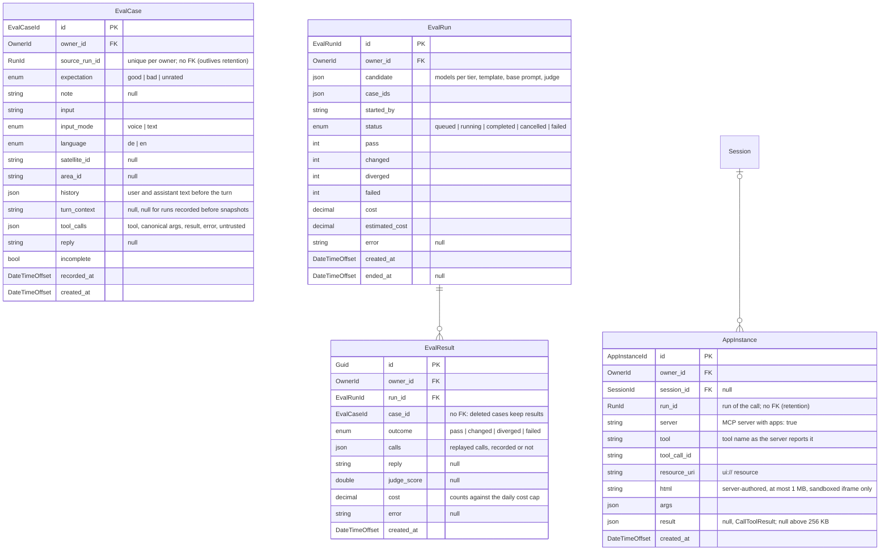

```mermaid
erDiagram
%% KEEP UP TO DATE: must match the EF Core model in src/ (Marshal.Data). Update it in the same change that adds,
%% removes or renames an entity, column or relationship (see docs/diagrams/README.md).
%% Owner edges (owner_id to User) are not drawn. A relationship is drawn in the diagram of the entity that holds the key.
    AppInstance {
        AppInstanceId id PK
        OwnerId owner_id FK
        SessionId session_id FK "null"
        RunId run_id "run of the call; no FK (retention)"
        string server "MCP server with apps: true"
        string tool "tool name as the server reports it"
        string tool_call_id
        string resource_uri "ui:// resource"
        string html "server-authored, at most 1 MB, sandboxed iframe only"
        json args
        json result "null, CallToolResult; null above 256 KB"
        DateTimeOffset created_at
    }
    EvalCase {
        EvalCaseId id PK
        OwnerId owner_id FK
        RunId source_run_id "unique per owner; no FK (outlives retention)"
        enum expectation "good | bad | unrated"
        string note "null"
        string input
        enum input_mode "voice | text"
        enum language "de | en"
        string satellite_id "null"
        string area_id "null"
        json history "user and assistant text before the turn"
        string turn_context "null, null for runs recorded before snapshots"
        json tool_calls "tool, canonical args, result, error, untrusted"
        string reply "null"
        bool incomplete
        DateTimeOffset recorded_at
        DateTimeOffset created_at
    }
    EvalRun {
        EvalRunId id PK
        OwnerId owner_id FK
        json candidate "models per tier, template, base prompt, judge"
        json case_ids
        string started_by
        enum status "queued | running | completed | cancelled | failed"
        int pass
        int changed
        int diverged
        int failed
        decimal cost
        decimal estimated_cost
        string error "null"
        DateTimeOffset created_at
        DateTimeOffset ended_at "null"
    }
    EvalResult {
        Guid id PK
        OwnerId owner_id FK
        EvalRunId run_id FK
        EvalCaseId case_id "no FK: deleted cases keep results"
        enum outcome "pass | changed | diverged | failed"
        json calls "replayed calls, recorded or not"
        string reply "null"
        double judge_score "null"
        decimal cost "counts against the daily cost cap"
        string error "null"
        DateTimeOffset created_at
    }
    EvalRun ||--o{ EvalResult : ""
    Session |o--o{ AppInstance : ""
```
