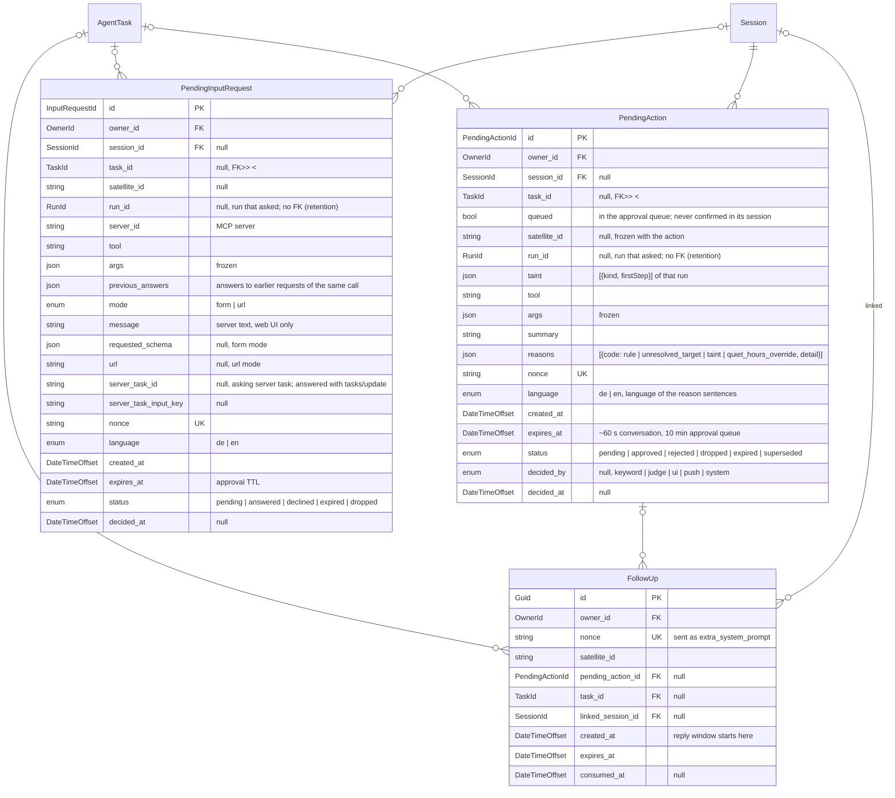

```mermaid
erDiagram
%% KEEP UP TO DATE: must match the EF Core model in src/ (Marshal.Data). Update it in the same change that adds,
%% removes or renames an entity, column or relationship (see docs/diagrams/README.md).
%% Owner edges (owner_id to User) are not drawn. A relationship is drawn in the diagram of the entity that holds the key.
    PendingAction {
        PendingActionId id PK
        OwnerId owner_id FK
        SessionId session_id FK "null"
        TaskId task_id "null, FK>>  <<null for session actions and taskless approvals"
        bool queued "in the approval queue; never confirmed in its session"
        string satellite_id "null, frozen with the action"
        RunId run_id "null, run that asked; no FK (retention)"
        json taint "[{kind, firstStep}] of that run"
        string tool
        json args "frozen"
        string summary
        json reasons "[{code: rule | unresolved_target | taint | quiet_hours_override, detail}]"
        string nonce UK
        enum language "de | en, language of the reason sentences"
        DateTimeOffset created_at
        DateTimeOffset expires_at "~60 s conversation, 10 min approval queue"
        enum status "pending | approved | rejected | dropped | expired | superseded"
        enum decided_by "null, keyword | judge | ui | push | system"
        DateTimeOffset decided_at "null"
    }
    PendingInputRequest {
        InputRequestId id PK
        OwnerId owner_id FK
        SessionId session_id FK "null"
        TaskId task_id "null, FK>>  <<task resumed with the outcome"
        string satellite_id "null"
        RunId run_id "null, run that asked; no FK (retention)"
        string server_id "MCP server"
        string tool
        json args "frozen"
        json previous_answers "answers to earlier requests of the same call"
        enum mode "form | url"
        string message "server text, web UI only"
        json requested_schema "null, form mode"
        string url "null, url mode"
        string server_task_id "null, asking server task; answered with tasks/update"
        string server_task_input_key "null"
        string nonce UK
        enum language "de | en"
        DateTimeOffset created_at
        DateTimeOffset expires_at "approval TTL"
        enum status "pending | answered | declined | expired | dropped"
        DateTimeOffset decided_at "null"
    }
    FollowUp {
        Guid id PK
        OwnerId owner_id FK
        string nonce UK "sent as extra_system_prompt"
        string satellite_id
        PendingActionId pending_action_id FK "null"
        TaskId task_id FK "null"
        SessionId linked_session_id FK "null"
        DateTimeOffset created_at "reply window starts here"
        DateTimeOffset expires_at
        DateTimeOffset consumed_at "null"
    }
    AgentTask |o--o{ PendingInputRequest : ""
    AgentTask |o--o{ FollowUp : ""
    AgentTask |o--o{ PendingAction : ""
    Session |o--o{ PendingInputRequest : ""
    PendingAction |o--o{ FollowUp : ""
    Session |o--o{ FollowUp : "linked"
    Session ||--o{ PendingAction : ""
```
