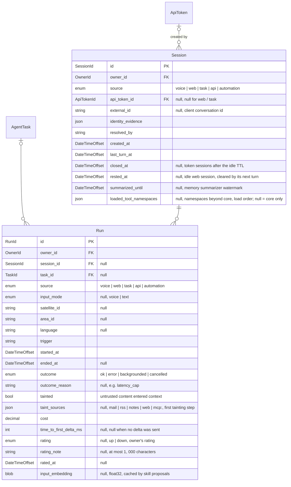

```mermaid
erDiagram
%% KEEP UP TO DATE: must match the EF Core model in src/ (Marshal.Data). Update it in the same change that adds,
%% removes or renames an entity, column or relationship (see docs/diagrams/README.md).
%% Owner edges (owner_id to User) are not drawn. A relationship is drawn in the diagram of the entity that holds the key.
    Session {
        SessionId id PK
        OwnerId owner_id FK
        enum source "voice | web | task | api | automation"
        ApiTokenId api_token_id FK "null, null for web / task"
        string external_id "null, client conversation id"
        json identity_evidence
        string resolved_by
        DateTimeOffset created_at
        DateTimeOffset last_turn_at
        DateTimeOffset closed_at "null, token sessions after the idle TTL"
        DateTimeOffset rested_at "null, idle web session, cleared by its next turn"
        DateTimeOffset summarized_until "null, memory summarizer watermark"
        json loaded_tool_namespaces "null, namespaces beyond core, load order; null = core only"
    }
    Run {
        RunId id PK
        OwnerId owner_id FK
        SessionId session_id FK "null"
        TaskId task_id FK "null"
        enum source "voice | web | task | api | automation"
        enum input_mode "null, voice | text"
        string satellite_id "null"
        string area_id "null"
        string language "null"
        string trigger
        DateTimeOffset started_at
        DateTimeOffset ended_at "null"
        enum outcome "ok | error | backgrounded | cancelled"
        string outcome_reason "null, e.g. latency_cap"
        bool tainted "untrusted content entered context"
        json taint_sources "null, mail | rss | notes | web | mcp:<id>, first tainting step"
        decimal cost
        int time_to_first_delta_ms "null, null when no delta was sent"
        enum rating "null, up | down, owner's rating"
        string rating_note "null, at most 1, 000 characters"
        DateTimeOffset rated_at "null"
        blob input_embedding "null, float32, cached by skill proposals"
    }
    AgentTask |o--o{ Run : ""
    ApiToken |o--o{ Session : "created by"
    Session ||--o{ Run : ""
```
