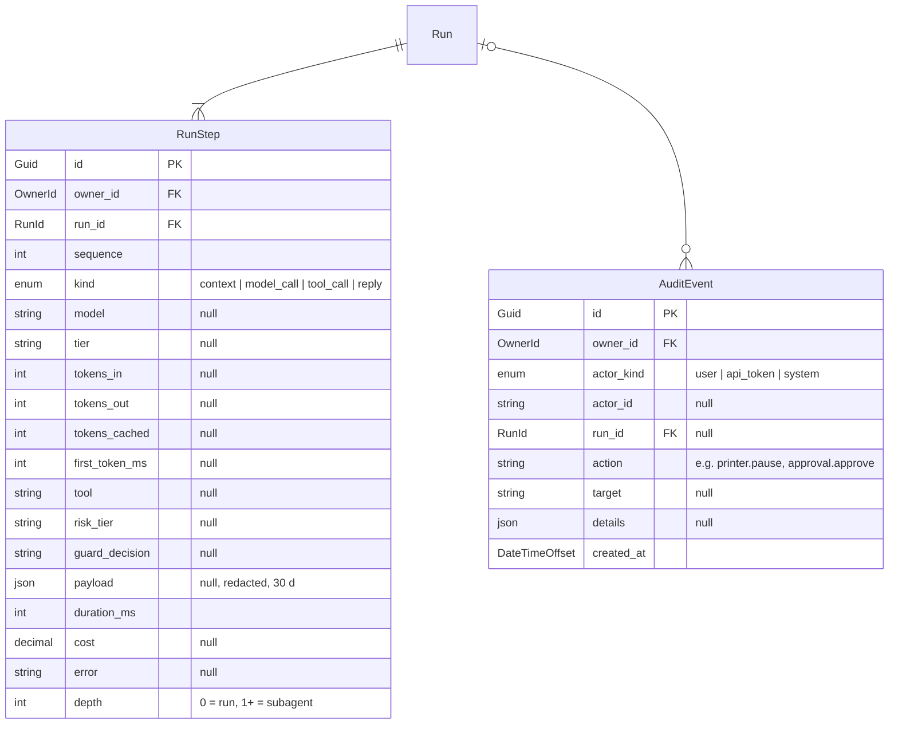

```mermaid
erDiagram
%% KEEP UP TO DATE: must match the EF Core model in src/ (Marshal.Data). Update it in the same change that adds,
%% removes or renames an entity, column or relationship (see docs/diagrams/README.md).
%% Owner edges (owner_id to User) are not drawn. A relationship is drawn in the diagram of the entity that holds the key.
    RunStep {
        Guid id PK
        OwnerId owner_id FK
        RunId run_id FK
        int sequence
        enum kind "context | model_call | tool_call | reply"
        string model "null"
        string tier "null"
        int tokens_in "null"
        int tokens_out "null"
        int tokens_cached "null"
        int first_token_ms "null"
        string tool "null"
        string risk_tier "null"
        string guard_decision "null"
        json payload "null, redacted, 30 d"
        int duration_ms
        decimal cost "null"
        string error "null"
        int depth "0 = run, 1+ = subagent"
    }
    AuditEvent {
        Guid id PK
        OwnerId owner_id FK
        enum actor_kind "user | api_token | system"
        string actor_id "null"
        RunId run_id FK "null"
        string action "e.g. printer.pause, approval.approve"
        string target "null"
        json details "null"
        DateTimeOffset created_at
    }
    Run ||--|{ RunStep : ""
    Run |o--o{ AuditEvent : ""
```
