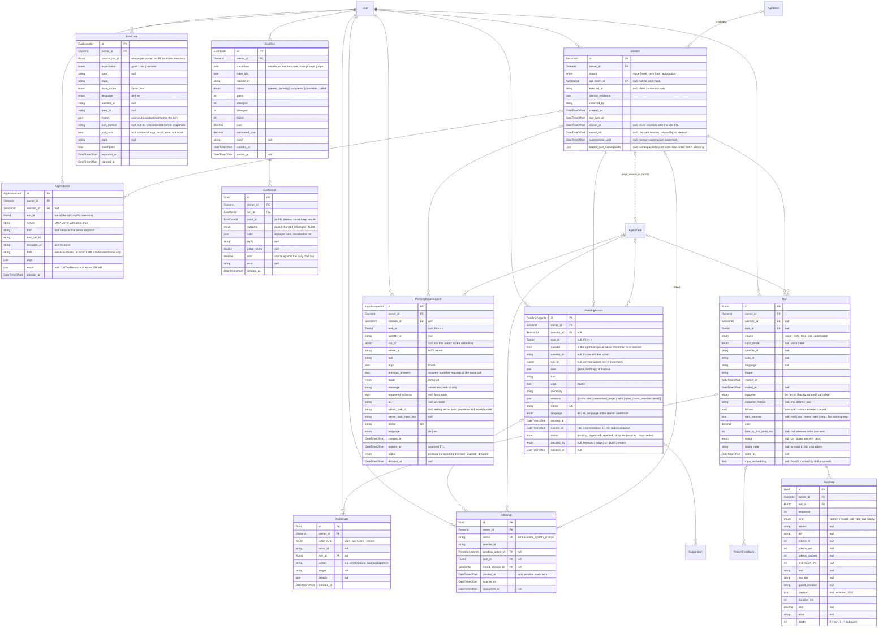

```mermaid
erDiagram
%% KEEP UP TO DATE: must match the EF Core model in src/ (Marshal.Data). Update it in the same change that adds,
%% removes or renames an entity, column or relationship (see docs/diagrams/README.md).
    Session {
        SessionId id PK
        OwnerId owner_id FK
        enum source "voice | web | task | api | automation"
        ApiTokenId api_token_id FK "null, null for web / task"
        string external_id "null, client conversation id"
        json identity_evidence
        string resolved_by
        DateTimeOffset created_at
        DateTimeOffset last_turn_at
        DateTimeOffset closed_at "null, token sessions after the idle TTL"
        DateTimeOffset rested_at "null, idle web session, cleared by its next turn"
        DateTimeOffset summarized_until "null, memory summarizer watermark"
        json loaded_tool_namespaces "null, namespaces beyond core, load order; null = core only"
    }
    Run {
        RunId id PK
        OwnerId owner_id FK
        SessionId session_id FK "null"
        TaskId task_id FK "null"
        enum source "voice | web | task | api | automation"
        enum input_mode "null, voice | text"
        string satellite_id "null"
        string area_id "null"
        string language "null"
        string trigger
        DateTimeOffset started_at
        DateTimeOffset ended_at "null"
        enum outcome "ok | error | backgrounded | cancelled"
        string outcome_reason "null, e.g. latency_cap"
        bool tainted "untrusted content entered context"
        json taint_sources "null, mail | rss | notes | web | mcp:<id>, first tainting step"
        decimal cost
        int time_to_first_delta_ms "null, null when no delta was sent"
        enum rating "null, up | down, owner's rating"
        string rating_note "null, at most 1, 000 characters"
        DateTimeOffset rated_at "null"
        blob input_embedding "null, float32, cached by skill proposals"
    }
    RunStep {
        Guid id PK
        OwnerId owner_id FK
        RunId run_id FK
        int sequence
        enum kind "context | model_call | tool_call | reply"
        string model "null"
        string tier "null"
        int tokens_in "null"
        int tokens_out "null"
        int tokens_cached "null"
        int first_token_ms "null"
        string tool "null"
        string risk_tier "null"
        string guard_decision "null"
        json payload "null, redacted, 30 d"
        int duration_ms
        decimal cost "null"
        string error "null"
        int depth "0 = run, 1+ = subagent"
    }
    PendingAction {
        PendingActionId id PK
        OwnerId owner_id FK
        SessionId session_id FK "null"
        TaskId task_id "null, FK>>  <<null for session actions and taskless approvals"
        bool queued "in the approval queue; never confirmed in its session"
        string satellite_id "null, frozen with the action"
        RunId run_id "null, run that asked; no FK (retention)"
        json taint "[{kind, firstStep}] of that run"
        string tool
        json args "frozen"
        string summary
        json reasons "[{code: rule | unresolved_target | taint | quiet_hours_override, detail}]"
        string nonce UK
        enum language "de | en, language of the reason sentences"
        DateTimeOffset created_at
        DateTimeOffset expires_at "~60 s conversation, 10 min approval queue"
        enum status "pending | approved | rejected | dropped | expired | superseded"
        enum decided_by "null, keyword | judge | ui | push | system"
        DateTimeOffset decided_at "null"
    }
    PendingInputRequest {
        InputRequestId id PK
        OwnerId owner_id FK
        SessionId session_id FK "null"
        TaskId task_id "null, FK>>  <<task resumed with the outcome"
        string satellite_id "null"
        RunId run_id "null, run that asked; no FK (retention)"
        string server_id "MCP server"
        string tool
        json args "frozen"
        json previous_answers "answers to earlier requests of the same call"
        enum mode "form | url"
        string message "server text, web UI only"
        json requested_schema "null, form mode"
        string url "null, url mode"
        string server_task_id "null, asking server task; answered with tasks/update"
        string server_task_input_key "null"
        string nonce UK
        enum language "de | en"
        DateTimeOffset created_at
        DateTimeOffset expires_at "approval TTL"
        enum status "pending | answered | declined | expired | dropped"
        DateTimeOffset decided_at "null"
    }
    AppInstance {
        AppInstanceId id PK
        OwnerId owner_id FK
        SessionId session_id FK "null"
        RunId run_id "run of the call; no FK (retention)"
        string server "MCP server with apps: true"
        string tool "tool name as the server reports it"
        string tool_call_id
        string resource_uri "ui:// resource"
        string html "server-authored, at most 1 MB, sandboxed iframe only"
        json args
        json result "null, CallToolResult; null above 256 KB"
        DateTimeOffset created_at
    }
    EvalCase {
        EvalCaseId id PK
        OwnerId owner_id FK
        RunId source_run_id "unique per owner; no FK (outlives retention)"
        enum expectation "good | bad | unrated"
        string note "null"
        string input
        enum input_mode "voice | text"
        enum language "de | en"
        string satellite_id "null"
        string area_id "null"
        json history "user and assistant text before the turn"
        string turn_context "null, null for runs recorded before snapshots"
        json tool_calls "tool, canonical args, result, error, untrusted"
        string reply "null"
        bool incomplete
        DateTimeOffset recorded_at
        DateTimeOffset created_at
    }
    EvalRun {
        EvalRunId id PK
        OwnerId owner_id FK
        json candidate "models per tier, template, base prompt, judge"
        json case_ids
        string started_by
        enum status "queued | running | completed | cancelled | failed"
        int pass
        int changed
        int diverged
        int failed
        decimal cost
        decimal estimated_cost
        string error "null"
        DateTimeOffset created_at
        DateTimeOffset ended_at "null"
    }
    EvalResult {
        Guid id PK
        OwnerId owner_id FK
        EvalRunId run_id FK
        EvalCaseId case_id "no FK: deleted cases keep results"
        enum outcome "pass | changed | diverged | failed"
        json calls "replayed calls, recorded or not"
        string reply "null"
        double judge_score "null"
        decimal cost "counts against the daily cost cap"
        string error "null"
        DateTimeOffset created_at
    }
    FollowUp {
        Guid id PK
        OwnerId owner_id FK
        string nonce UK "sent as extra_system_prompt"
        string satellite_id
        PendingActionId pending_action_id FK "null"
        TaskId task_id FK "null"
        SessionId linked_session_id FK "null"
        DateTimeOffset created_at "reply window starts here"
        DateTimeOffset expires_at
        DateTimeOffset consumed_at "null"
    }
    AuditEvent {
        Guid id PK
        OwnerId owner_id FK
        enum actor_kind "user | api_token | system"
        string actor_id "null"
        RunId run_id FK "null"
        string action "e.g. printer.pause, approval.approve"
        string target "null"
        json details "null"
        DateTimeOffset created_at
    }
    User ||--o{ Session : ""
    User ||--o{ Run : ""
    User ||--o{ PendingAction : ""
    User ||--o{ PendingInputRequest : ""
    Session |o--o{ PendingInputRequest : ""
    AgentTask |o--o{ PendingInputRequest : ""
    User ||--o{ AppInstance : ""
    User ||--o{ EvalCase : ""
    User ||--o{ EvalRun : ""
    EvalRun ||--o{ EvalResult : ""
    Session |o--o{ AppInstance : ""
    PendingAction |o--o{ Suggestion : ""
    User ||--o{ AuditEvent : ""
    User ||--o{ FollowUp : ""
    PendingAction |o--o{ FollowUp : ""
    AgentTask |o--o{ FollowUp : ""
    Session |o--o{ FollowUp : "linked"
    ApiToken |o--o{ Session : "created by"
    Session ||--o{ Run : ""
    Session ||--o{ PendingAction : ""
    Session |o..o{ AgentTask : "origin_session_id (no FK)"
    Run ||--|{ RunStep : ""
    Run |o--o{ ProjectFeedback : ""
    AgentTask |o--o{ Run : ""
    AgentTask |o--o{ PendingAction : ""
    Run |o--o{ AuditEvent : ""
```
