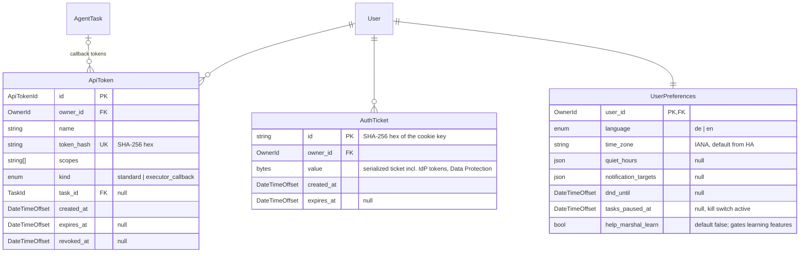

```mermaid
erDiagram
%% KEEP UP TO DATE: must match the EF Core model in src/ (Marshal.Data). Update it in the same change that adds,
%% removes or renames an entity, column or relationship (see docs/diagrams/README.md).
%% Owner edges (owner_id to User) are not drawn. A relationship is drawn in the diagram of the entity that holds the key.
    ApiToken {
        ApiTokenId id PK
        OwnerId owner_id FK
        string name
        string token_hash UK "SHA-256 hex"
        string[] scopes
        enum kind "standard | executor_callback"
        TaskId task_id FK "null"
        DateTimeOffset created_at
        DateTimeOffset expires_at "null"
        DateTimeOffset revoked_at "null"
    }
    AuthTicket {
        string id PK "SHA-256 hex of the cookie key"
        OwnerId owner_id FK
        bytes value "serialized ticket incl. IdP tokens, Data Protection"
        DateTimeOffset created_at
        DateTimeOffset expires_at "null"
    }
    UserPreferences {
        OwnerId user_id PK,FK
        enum language "de | en"
        string time_zone "IANA, default from HA"
        json quiet_hours "null"
        json notification_targets "null"
        DateTimeOffset dnd_until "null"
        DateTimeOffset tasks_paused_at "null, kill switch active"
        bool help_marshal_learn "default false; gates learning features"
    }
    AgentTask |o--o{ ApiToken : "callback tokens"
    User ||--o{ ApiToken : ""
    User ||--o{ AuthTicket : ""
    User ||--|| UserPreferences : ""
```
