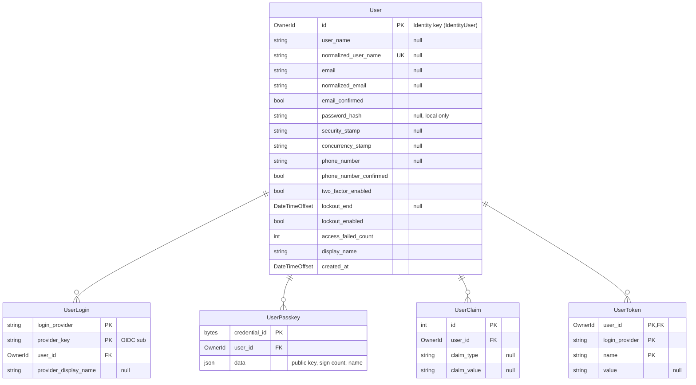

```mermaid
erDiagram
%% KEEP UP TO DATE: must match the EF Core model in src/ (Marshal.Data). Update it in the same change that adds,
%% removes or renames an entity, column or relationship (see docs/diagrams/README.md).
%% Owner edges (owner_id to User) are not drawn. A relationship is drawn in the diagram of the entity that holds the key.
    User {
        OwnerId id PK "Identity key (IdentityUser<OwnerId>)"
        string user_name "null"
        string normalized_user_name UK "null"
        string email "null"
        string normalized_email "null"
        bool email_confirmed
        string password_hash "null, local only"
        string security_stamp "null"
        string concurrency_stamp "null"
        string phone_number "null"
        bool phone_number_confirmed
        bool two_factor_enabled
        DateTimeOffset lockout_end "null"
        bool lockout_enabled
        int access_failed_count
        string display_name
        DateTimeOffset created_at
    }
    UserLogin {
        string login_provider PK
        string provider_key PK "OIDC sub"
        OwnerId user_id FK
        string provider_display_name "null"
    }
    UserPasskey {
        bytes credential_id PK
        OwnerId user_id FK
        json data "public key, sign count, name"
    }
    UserClaim {
        int id PK
        OwnerId user_id FK
        string claim_type "null"
        string claim_value "null"
    }
    UserToken {
        OwnerId user_id PK,FK
        string login_provider PK
        string name PK
        string value "null"
    }
    User ||--o{ UserLogin : ""
    User ||--o{ UserPasskey : ""
    User ||--o{ UserClaim : ""
    User ||--o{ UserToken : ""
```
