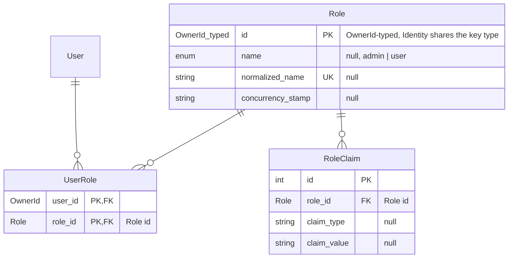

```mermaid
erDiagram
%% KEEP UP TO DATE: must match the EF Core model in src/ (Marshal.Data). Update it in the same change that adds,
%% removes or renames an entity, column or relationship (see docs/diagrams/README.md).
%% Owner edges (owner_id to User) are not drawn. A relationship is drawn in the diagram of the entity that holds the key.
    Role {
        OwnerId_typed id PK "OwnerId-typed, Identity shares the key type"
        enum name "null, admin | user"
        string normalized_name UK "null"
        string concurrency_stamp "null"
    }
    UserRole {
        OwnerId user_id PK,FK
        Role role_id PK,FK "Role id"
    }
    RoleClaim {
        int id PK
        Role role_id FK "Role id"
        string claim_type "null"
        string claim_value "null"
    }
    User ||--o{ UserRole : ""
    Role ||--o{ UserRole : ""
    Role ||--o{ RoleClaim : ""
```
