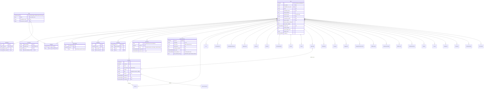

```mermaid
erDiagram
%% KEEP UP TO DATE: must match the EF Core model in src/ (Marshal.Data). Update it in the same change that adds,
%% removes or renames an entity, column or relationship (see docs/diagrams/README.md).
    User {
        OwnerId id PK "Identity key (IdentityUser<OwnerId>)"
        string user_name "null"
        string normalized_user_name UK "null"
        string email "null"
        string normalized_email "null"
        bool email_confirmed
        string password_hash "null, local only"
        string security_stamp "null"
        string concurrency_stamp "null"
        string phone_number "null"
        bool phone_number_confirmed
        bool two_factor_enabled
        DateTimeOffset lockout_end "null"
        bool lockout_enabled
        int access_failed_count
        string display_name
        DateTimeOffset created_at
    }
    UserLogin {
        string login_provider PK
        string provider_key PK "OIDC sub"
        OwnerId user_id FK
        string provider_display_name "null"
    }
    UserPasskey {
        bytes credential_id PK
        OwnerId user_id FK
        json data "public key, sign count, name"
    }
    Role {
        OwnerId_typed id PK "OwnerId-typed, Identity shares the key type"
        enum name "null, admin | user"
        string normalized_name UK "null"
        string concurrency_stamp "null"
    }
    UserRole {
        OwnerId user_id PK,FK
        Role role_id PK,FK "Role id"
    }
    UserClaim {
        int id PK
        OwnerId user_id FK
        string claim_type "null"
        string claim_value "null"
    }
    UserToken {
        OwnerId user_id PK,FK
        string login_provider PK
        string name PK
        string value "null"
    }
    RoleClaim {
        int id PK
        Role role_id FK "Role id"
        string claim_type "null"
        string claim_value "null"
    }
    ApiToken {
        ApiTokenId id PK
        OwnerId owner_id FK
        string name
        string token_hash UK "SHA-256 hex"
        string[] scopes
        enum kind "standard | executor_callback"
        TaskId task_id FK "null"
        DateTimeOffset created_at
        DateTimeOffset expires_at "null"
        DateTimeOffset revoked_at "null"
    }
    AuthTicket {
        string id PK "SHA-256 hex of the cookie key"
        OwnerId owner_id FK
        bytes value "serialized ticket incl. IdP tokens, Data Protection"
        DateTimeOffset created_at
        DateTimeOffset expires_at "null"
    }
    UserPreferences {
        OwnerId user_id PK,FK
        enum language "de | en"
        string time_zone "IANA, default from HA"
        json quiet_hours "null"
        json notification_targets "null"
        DateTimeOffset dnd_until "null"
        DateTimeOffset tasks_paused_at "null, kill switch active"
        bool help_marshal_learn "default false; gates learning features"
    }
    User ||--o{ UserLogin : ""
    User ||--o{ UserPasskey : ""
    User ||--o{ UserRole : ""
    Role ||--o{ UserRole : ""
    User ||--o{ UserClaim : ""
    User ||--o{ UserToken : ""
    Role ||--o{ RoleClaim : ""
    User ||--o{ ApiToken : ""
    User ||--o{ AuthTicket : ""
    User ||--|| UserPreferences : ""
    User ||--o{ Session : ""
    User ||--o{ Run : ""
    User ||--o{ PendingAction : ""
    User ||--o{ PendingInputRequest : ""
    User ||--o{ AppInstance : ""
    User ||--o{ EvalCase : ""
    User ||--o{ EvalRun : ""
    User ||--o{ McpTaskHandle : ""
    User ||--o{ Project : ""
    User ||--o{ Chunk : ""
    User ||--o{ AgentTask : ""
    User ||--o{ Notification : ""
    User ||--o{ Proposal : ""
    User ||--o{ Suggestion : ""
    User ||--o{ SuggestionDetectorStat : ""
    User ||--o{ SkillProposal : ""
    User ||--o{ MaintenanceState : ""
    User ||--o{ MailAccount : ""
    User ||--o{ CalDavSyncState : ""
    User ||--o{ Artifact : ""
    User |o--o{ Secret : ""
    User ||--o{ AuditEvent : ""
    User ||--o{ FollowUp : ""
    User ||--o{ NoteIndexEntry : ""
    User ||--o{ DemoSeed : ""
    ApiToken |o--o{ Session : "created by"
    AgentTask |o--o{ ApiToken : "callback tokens"
    ApiToken |o--o| ExecutorSession : "callback"
```
