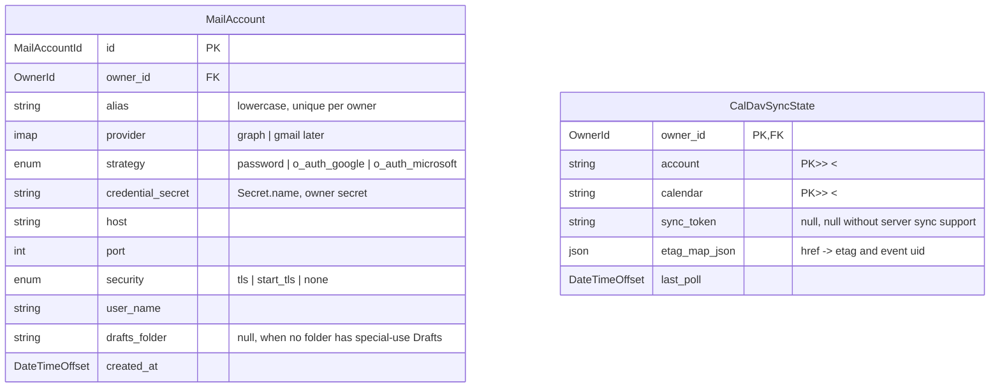

```mermaid
erDiagram
%% KEEP UP TO DATE: must match the EF Core model in src/ (Marshal.Data). Update it in the same change that adds,
%% removes or renames an entity, column or relationship (see docs/diagrams/README.md).
%% Owner edges (owner_id to User) are not drawn. A relationship is drawn in the diagram of the entity that holds the key.
    MailAccount {
        MailAccountId id PK
        OwnerId owner_id FK
        string alias "lowercase, unique per owner"
        imap provider "graph | gmail later"
        enum strategy "password | o_auth_google | o_auth_microsoft"
        string credential_secret "Secret.name, owner secret"
        string host
        int port
        enum security "tls | start_tls | none"
        string user_name
        string drafts_folder "null, when no folder has special-use Drafts"
        DateTimeOffset created_at
    }
    CalDavSyncState {
        OwnerId owner_id PK,FK
        string account "PK>>  <<calendar.caldav.accounts key"
        string calendar "PK>>  <<last path segment of the collection"
        string sync_token "null, null without server sync support"
        json etag_map_json "href -> etag and event uid"
        DateTimeOffset last_poll
    }
```
