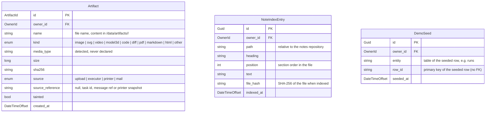

```mermaid
erDiagram
%% KEEP UP TO DATE: must match the EF Core model in src/ (Marshal.Data). Update it in the same change that adds,
%% removes or renames an entity, column or relationship (see docs/diagrams/README.md).
%% Owner edges (owner_id to User) are not drawn. A relationship is drawn in the diagram of the entity that holds the key.
    Artifact {
        ArtifactId id PK
        OwnerId owner_id FK
        string name "file name, content in /data/artifacts/<owner>/<id>"
        enum kind "image | svg | video | model3d | code | diff | pdf | markdown | html | other"
        string media_type "detected, never declared"
        long size
        string sha256
        enum source "upload | executor | printer | mail"
        string source_reference "null, task id, message ref or printer snapshot"
        bool tainted
        DateTimeOffset created_at
    }
    NoteIndexEntry {
        Guid id PK
        OwnerId owner_id FK
        string path "relative to the notes repository"
        string heading
        int position "section order in the file"
        string text
        string file_hash "SHA-256 of the file when indexed"
        DateTimeOffset indexed_at
    }
    DemoSeed {
        Guid id PK
        OwnerId owner_id FK
        string entity "table of the seeded row, e.g. runs"
        string row_id "primary key of the seeded row (no FK)"
        DateTimeOffset seeded_at
    }
```
