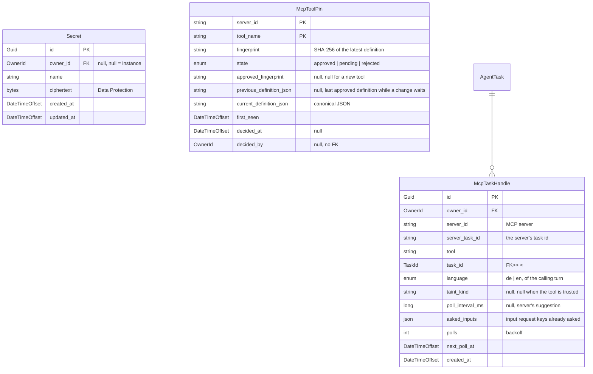

```mermaid
erDiagram
%% KEEP UP TO DATE: must match the EF Core model in src/ (Marshal.Data). Update it in the same change that adds,
%% removes or renames an entity, column or relationship (see docs/diagrams/README.md).
%% Owner edges (owner_id to User) are not drawn. A relationship is drawn in the diagram of the entity that holds the key.
    Secret {
        Guid id PK
        OwnerId owner_id FK "null, null = instance"
        string name
        bytes ciphertext "Data Protection"
        DateTimeOffset created_at
        DateTimeOffset updated_at
    }
    McpToolPin {
        string server_id PK
        string tool_name PK
        string fingerprint "SHA-256 of the latest definition"
        enum state "approved | pending | rejected"
        string approved_fingerprint "null, null for a new tool"
        string previous_definition_json "null, last approved definition while a change waits"
        string current_definition_json "canonical JSON"
        DateTimeOffset first_seen
        DateTimeOffset decided_at "null"
        OwnerId decided_by "null, no FK"
    }
    McpTaskHandle {
        Guid id PK
        OwnerId owner_id FK
        string server_id "MCP server"
        string server_task_id "the server's task id"
        string tool
        TaskId task_id "FK>>  <<waiting task resumed with the outcome"
        enum language "de | en, of the calling turn"
        string taint_kind "null, null when the tool is trusted"
        long poll_interval_ms "null, server's suggestion"
        json asked_inputs "input request keys already asked"
        int polls "backoff"
        DateTimeOffset next_poll_at
        DateTimeOffset created_at
    }
    AgentTask ||--o{ McpTaskHandle : ""
```
