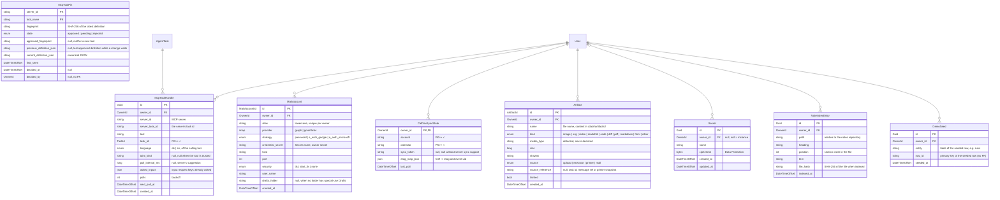

```mermaid
erDiagram
%% KEEP UP TO DATE: must match the EF Core model in src/ (Marshal.Data). Update it in the same change that adds,
%% removes or renames an entity, column or relationship (see docs/diagrams/README.md).
    Secret {
        Guid id PK
        OwnerId owner_id FK "null, null = instance"
        string name
        bytes ciphertext "Data Protection"
        DateTimeOffset created_at
        DateTimeOffset updated_at
    }
    McpToolPin {
        string server_id PK
        string tool_name PK
        string fingerprint "SHA-256 of the latest definition"
        enum state "approved | pending | rejected"
        string approved_fingerprint "null, null for a new tool"
        string previous_definition_json "null, last approved definition while a change waits"
        string current_definition_json "canonical JSON"
        DateTimeOffset first_seen
        DateTimeOffset decided_at "null"
        OwnerId decided_by "null, no FK"
    }
    McpTaskHandle {
        Guid id PK
        OwnerId owner_id FK
        string server_id "MCP server"
        string server_task_id "the server's task id"
        string tool
        TaskId task_id "FK>>  <<waiting task resumed with the outcome"
        enum language "de | en, of the calling turn"
        string taint_kind "null, null when the tool is trusted"
        long poll_interval_ms "null, server's suggestion"
        json asked_inputs "input request keys already asked"
        int polls "backoff"
        DateTimeOffset next_poll_at
        DateTimeOffset created_at
    }
    MailAccount {
        MailAccountId id PK
        OwnerId owner_id FK
        string alias "lowercase, unique per owner"
        imap provider "graph | gmail later"
        enum strategy "password | o_auth_google | o_auth_microsoft"
        string credential_secret "Secret.name, owner secret"
        string host
        int port
        enum security "tls | start_tls | none"
        string user_name
        string drafts_folder "null, when no folder has special-use Drafts"
        DateTimeOffset created_at
    }
    CalDavSyncState {
        OwnerId owner_id PK,FK
        string account "PK>>  <<calendar.caldav.accounts key"
        string calendar "PK>>  <<last path segment of the collection"
        string sync_token "null, null without server sync support"
        json etag_map_json "href -> etag and event uid"
        DateTimeOffset last_poll
    }
    Artifact {
        ArtifactId id PK
        OwnerId owner_id FK
        string name "file name, content in /data/artifacts/<owner>/<id>"
        enum kind "image | svg | video | model3d | code | diff | pdf | markdown | html | other"
        string media_type "detected, never declared"
        long size
        string sha256
        enum source "upload | executor | printer | mail"
        string source_reference "null, task id, message ref or printer snapshot"
        bool tainted
        DateTimeOffset created_at
    }
    NoteIndexEntry {
        Guid id PK
        OwnerId owner_id FK
        string path "relative to the notes repository"
        string heading
        int position "section order in the file"
        string text
        string file_hash "SHA-256 of the file when indexed"
        DateTimeOffset indexed_at
    }
    DemoSeed {
        Guid id PK
        OwnerId owner_id FK
        string entity "table of the seeded row, e.g. runs"
        string row_id "primary key of the seeded row (no FK)"
        DateTimeOffset seeded_at
    }
    User ||--o{ McpTaskHandle : ""
    AgentTask ||--o{ McpTaskHandle : ""
    User ||--o{ MailAccount : ""
    User ||--o{ CalDavSyncState : ""
    User ||--o{ Artifact : ""
    User |o--o{ Secret : ""
    User ||--o{ NoteIndexEntry : ""
    User ||--o{ DemoSeed : ""
```
