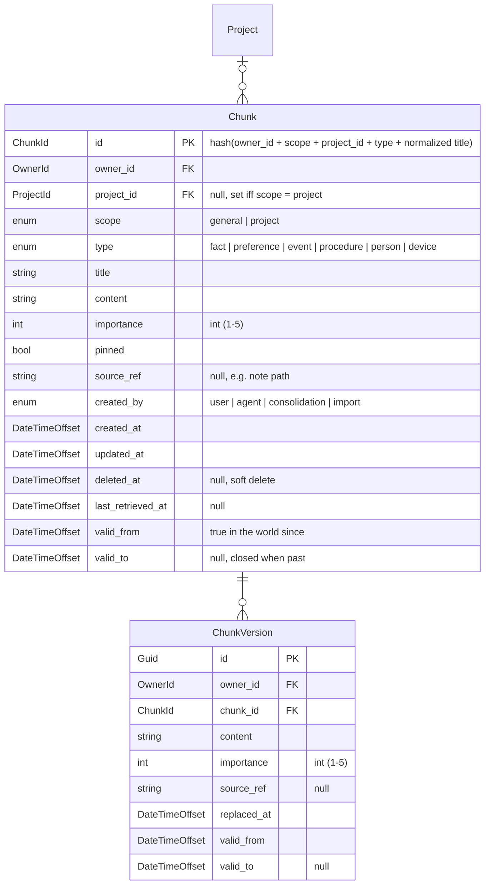

```mermaid
erDiagram
%% KEEP UP TO DATE: must match the EF Core model in src/ (Marshal.Data). Update it in the same change that adds,
%% removes or renames an entity, column or relationship (see docs/diagrams/README.md).
%% Owner edges (owner_id to User) are not drawn. A relationship is drawn in the diagram of the entity that holds the key.
    Chunk {
        ChunkId id PK "hash(owner_id + scope + project_id + type + normalized title)"
        OwnerId owner_id FK
        ProjectId project_id FK "null, set iff scope = project"
        enum scope "general | project"
        enum type "fact | preference | event | procedure | person | device"
        string title
        string content
        int importance "int (1-5)"
        bool pinned
        string source_ref "null, e.g. note path"
        enum created_by "user | agent | consolidation | import"
        DateTimeOffset created_at
        DateTimeOffset updated_at
        DateTimeOffset deleted_at "null, soft delete"
        DateTimeOffset last_retrieved_at "null"
        DateTimeOffset valid_from "true in the world since"
        DateTimeOffset valid_to "null, closed when past"
    }
    ChunkVersion {
        Guid id PK
        OwnerId owner_id FK
        ChunkId chunk_id FK
        string content
        int importance "int (1-5)"
        string source_ref "null"
        DateTimeOffset replaced_at
        DateTimeOffset valid_from
        DateTimeOffset valid_to "null"
    }
    Project |o--o{ Chunk : ""
    Chunk ||--o{ ChunkVersion : ""
```
