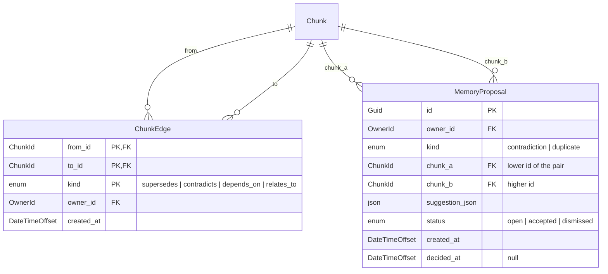

```mermaid
erDiagram
%% KEEP UP TO DATE: must match the EF Core model in src/ (Marshal.Data). Update it in the same change that adds,
%% removes or renames an entity, column or relationship (see docs/diagrams/README.md).
%% Owner edges (owner_id to User) are not drawn. A relationship is drawn in the diagram of the entity that holds the key.
    ChunkEdge {
        ChunkId from_id PK,FK
        ChunkId to_id PK,FK
        enum kind PK "supersedes | contradicts | depends_on | relates_to"
        OwnerId owner_id FK
        DateTimeOffset created_at
    }
    MemoryProposal {
        Guid id PK
        OwnerId owner_id FK
        enum kind "contradiction | duplicate"
        ChunkId chunk_a FK "lower id of the pair"
        ChunkId chunk_b FK "higher id"
        json suggestion_json
        enum status "open | accepted | dismissed"
        DateTimeOffset created_at
        DateTimeOffset decided_at "null"
    }
    Chunk ||--o{ ChunkEdge : "from"
    Chunk ||--o{ ChunkEdge : "to"
    Chunk ||--o{ MemoryProposal : "chunk_a"
    Chunk ||--o{ MemoryProposal : "chunk_b"
```
