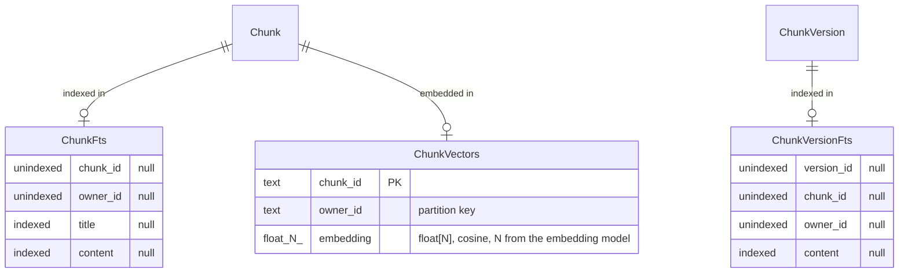

```mermaid
erDiagram
%% KEEP UP TO DATE: must match the EF Core model in src/ (Marshal.Data). Update it in the same change that adds,
%% removes or renames an entity, column or relationship (see docs/diagrams/README.md).
%% Owner edges (owner_id to User) are not drawn. A relationship is drawn in the diagram of the entity that holds the key.
    ChunkFts {
        unindexed chunk_id "null"
        unindexed owner_id "null"
        indexed title "null"
        indexed content "null"
    }
    ChunkVersionFts {
        unindexed version_id "null"
        unindexed chunk_id "null"
        unindexed owner_id "null"
        indexed content "null"
    }
    ChunkVectors {
        text chunk_id PK
        text owner_id "partition key"
        float_N_ embedding "float[N], cosine, N from the embedding model"
    }
    Chunk ||--o| ChunkFts : "indexed in"
    ChunkVersion ||--o| ChunkVersionFts : "indexed in"
    Chunk ||--o| ChunkVectors : "embedded in"
```
