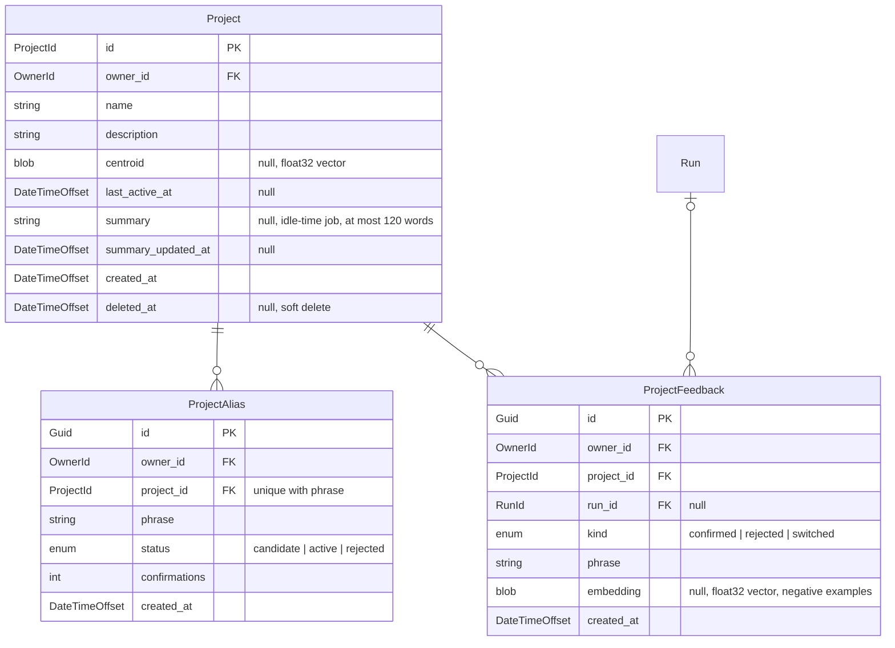

```mermaid
erDiagram
%% KEEP UP TO DATE: must match the EF Core model in src/ (Marshal.Data). Update it in the same change that adds,
%% removes or renames an entity, column or relationship (see docs/diagrams/README.md).
%% Owner edges (owner_id to User) are not drawn. A relationship is drawn in the diagram of the entity that holds the key.
    Project {
        ProjectId id PK
        OwnerId owner_id FK
        string name
        string description
        blob centroid "null, float32 vector"
        DateTimeOffset last_active_at "null"
        string summary "null, idle-time job, at most 120 words"
        DateTimeOffset summary_updated_at "null"
        DateTimeOffset created_at
        DateTimeOffset deleted_at "null, soft delete"
    }
    ProjectAlias {
        Guid id PK
        OwnerId owner_id FK
        ProjectId project_id FK "unique with phrase"
        string phrase
        enum status "candidate | active | rejected"
        int confirmations
        DateTimeOffset created_at
    }
    ProjectFeedback {
        Guid id PK
        OwnerId owner_id FK
        ProjectId project_id FK
        RunId run_id FK "null"
        enum kind "confirmed | rejected | switched"
        string phrase
        blob embedding "null, float32 vector, negative examples"
        DateTimeOffset created_at
    }
    Run |o--o{ ProjectFeedback : ""
    Project ||--o{ ProjectAlias : ""
    Project ||--o{ ProjectFeedback : ""
```
