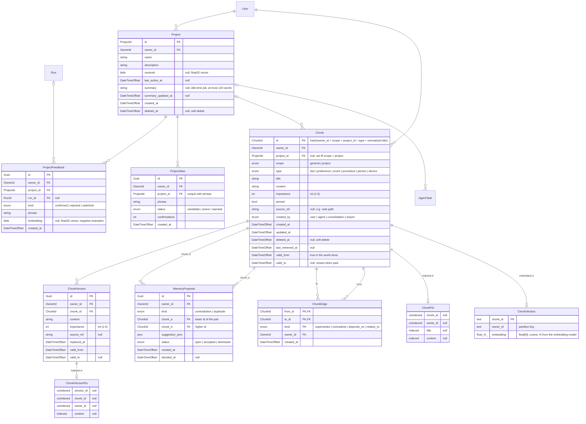

```mermaid
erDiagram
%% KEEP UP TO DATE: must match the EF Core model in src/ (Marshal.Data). Update it in the same change that adds,
%% removes or renames an entity, column or relationship (see docs/diagrams/README.md).
    Project {
        ProjectId id PK
        OwnerId owner_id FK
        string name
        string description
        blob centroid "null, float32 vector"
        DateTimeOffset last_active_at "null"
        string summary "null, idle-time job, at most 120 words"
        DateTimeOffset summary_updated_at "null"
        DateTimeOffset created_at
        DateTimeOffset deleted_at "null, soft delete"
    }
    ProjectFeedback {
        Guid id PK
        OwnerId owner_id FK
        ProjectId project_id FK
        RunId run_id FK "null"
        enum kind "confirmed | rejected | switched"
        string phrase
        blob embedding "null, float32 vector, negative examples"
        DateTimeOffset created_at
    }
    ProjectAlias {
        Guid id PK
        OwnerId owner_id FK
        ProjectId project_id FK "unique with phrase"
        string phrase
        enum status "candidate | active | rejected"
        int confirmations
        DateTimeOffset created_at
    }
    Chunk {
        ChunkId id PK "hash(owner_id + scope + project_id + type + normalized title)"
        OwnerId owner_id FK
        ProjectId project_id FK "null, set iff scope = project"
        enum scope "general | project"
        enum type "fact | preference | event | procedure | person | device"
        string title
        string content
        int importance "int (1-5)"
        bool pinned
        string source_ref "null, e.g. note path"
        enum created_by "user | agent | consolidation | import"
        DateTimeOffset created_at
        DateTimeOffset updated_at
        DateTimeOffset deleted_at "null, soft delete"
        DateTimeOffset last_retrieved_at "null"
        DateTimeOffset valid_from "true in the world since"
        DateTimeOffset valid_to "null, closed when past"
    }
    ChunkVersion {
        Guid id PK
        OwnerId owner_id FK
        ChunkId chunk_id FK
        string content
        int importance "int (1-5)"
        string source_ref "null"
        DateTimeOffset replaced_at
        DateTimeOffset valid_from
        DateTimeOffset valid_to "null"
    }
    MemoryProposal {
        Guid id PK
        OwnerId owner_id FK
        enum kind "contradiction | duplicate"
        ChunkId chunk_a FK "lower id of the pair"
        ChunkId chunk_b FK "higher id"
        json suggestion_json
        enum status "open | accepted | dismissed"
        DateTimeOffset created_at
        DateTimeOffset decided_at "null"
    }
    ChunkEdge {
        ChunkId from_id PK,FK
        ChunkId to_id PK,FK
        enum kind PK "supersedes | contradicts | depends_on | relates_to"
        OwnerId owner_id FK
        DateTimeOffset created_at
    }
    ChunkFts {
        unindexed chunk_id "null"
        unindexed owner_id "null"
        indexed title "null"
        indexed content "null"
    }
    ChunkVersionFts {
        unindexed version_id "null"
        unindexed chunk_id "null"
        unindexed owner_id "null"
        indexed content "null"
    }
    ChunkVectors {
        text chunk_id PK
        text owner_id "partition key"
        float_N_ embedding "float[N], cosine, N from the embedding model"
    }
    User ||--o{ Project : ""
    User ||--o{ Chunk : ""
    Project ||--o{ ProjectAlias : ""
    Project ||--o{ ProjectFeedback : ""
    Run |o--o{ ProjectFeedback : ""
    Project |o--o{ Chunk : ""
    Chunk ||--o{ ChunkVersion : ""
    Project |o--o{ AgentTask : ""
    Chunk ||--o{ ChunkEdge : "from"
    Chunk ||--o{ ChunkEdge : "to"
    Chunk ||--o| ChunkFts : "indexed in"
    ChunkVersion ||--o| ChunkVersionFts : "indexed in"
    Chunk ||--o{ MemoryProposal : "chunk_a"
    Chunk ||--o{ MemoryProposal : "chunk_b"
    Chunk ||--o| ChunkVectors : "embedded in"
```
