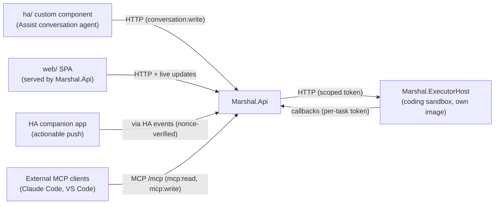

```mermaid
flowchart LR
%% Marshal: runtime connections
%% KEEP UP TO DATE: must match the clients and separate services that talk to Marshal (ha/, web/, MCP endpoint,
%% executor host). Update it in the same change that adds or removes one or changes how it connects (see
%% docs/diagrams/README.md).
    HaComponent["ha/ custom component<br/>(Assist conversation agent)"]
    Web["web/ SPA<br/>(served by Marshal.Api)"]
    Companion["HA companion app<br/>(actionable push)"]
    McpClients["External MCP clients<br/>(Claude Code, VS Code)"]
    Api["Marshal.Api"]
    ExecutorHost["Marshal.ExecutorHost<br/>(coding sandbox, own image)"]

    HaComponent -- "HTTP (conversation:write)" --> Api
    Web -- "HTTP + live updates" --> Api
    Companion -- "via HA events (nonce-verified)" --> Api
    McpClients -- "MCP /mcp (mcp:read, mcp:write)" --> Api
    Api -- "HTTP (scoped token)" --> ExecutorHost
    ExecutorHost -- "callbacks (per-task token)" --> Api
```
