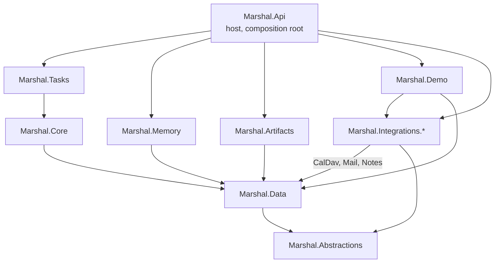

```mermaid
flowchart TB
%% Marshal: project references
%% KEEP UP TO DATE: must match the projects in src/ and their project references. Update it in the same change that
%% adds, removes or renames a project or changes a project reference (see docs/diagrams/README.md).
%% Arrows are project references ("depends on"). References that follow from another arrow are not drawn:
%% Marshal.Api also references Core and Data directly, and every project references Marshal.Abstractions.
    Api["Marshal.Api<br/>host, composition root"]
    Tasks["Marshal.Tasks"]
    Core["Marshal.Core"]
    Memory["Marshal.Memory"]
    Artifacts["Marshal.Artifacts"]
    Demo["Marshal.Demo"]
    Integrations["Marshal.Integrations.*"]
    Data["Marshal.Data"]
    Abstractions["Marshal.Abstractions"]

    Api --> Tasks & Memory & Artifacts & Demo & Integrations
    Tasks --> Core
    Demo --> Integrations
    Core & Memory & Artifacts & Demo --> Data
    Integrations -- "CalDav, Mail, Notes" --> Data
    Integrations --> Abstractions
    Data --> Abstractions
```
