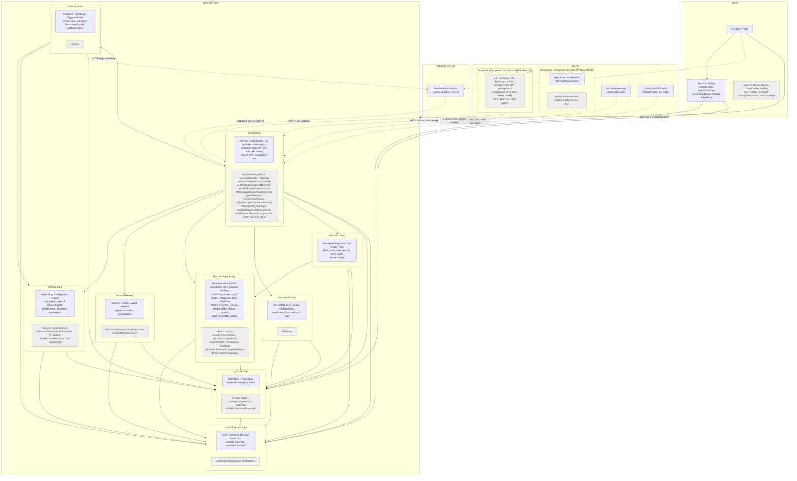

```mermaid
%% Marshal: packages
%% KEEP UP TO DATE: must match the projects in src/, web/ and ha/, their project references and their key external
%% packages. Update it in the same change that adds, removes or renames a project, changes a project reference or
%% adds or removes a key package (see docs/diagrams/README.md).
%% Solid arrows are project references ("depends on"), dotted arrows are runtime calls. Grey boxes are external
%% packages (NuGet, npm, pip) of the project they sit in.
flowchart TB
    subgraph Clients
        subgraph HaComponent["ha/ custom_components/marshal (Python, HACS)"]
            HaRuntime["no runtime requirements<br/>(HA's aiohttp session)"]
            HaPkgs["pytest-homeassistant-custom-component (uv, dev)"]:::pkg
        end
        subgraph Web["web/ (Vue SPA, served from Marshal.Api wwwroot)"]
            WebPkgs["vue, vue-router, vite, typescript, vue-tsc<br/>openapi-typescript + openapi-fetch<br/>markdown-it, three (lazy viewer chunk)<br/>vitest, @vue/test-utils, jsdom"]:::pkg
        end
        Companion["HA companion app<br/>(actionable push)"]
        McpClients["External MCP clients<br/>(Claude Code, VS Code)"]
    end

    subgraph Src["src/ (.NET 10)"]
        subgraph Api["Marshal.Api"]
            ApiHost["ASP.NET host: REST + live updates under /api/v1,<br/>versioned OpenAPI, BFF auth, API tokens,<br/>serves SPA, composition root"]
            ApiPkgs["Asp.Versioning.Http + Mvc.ApiExplorer + OpenApi<br/>Microsoft.AspNetCore.OpenApi<br/>Authentication.OpenIdConnect, Identity.EntityFrameworkCore<br/>NetEscapades.Configuration.Yaml<br/>OpenTelemetry.* (Extensions.Hosting, Exporter.OpenTelemetryProtocol)<br/>OllamaSharp, Anthropic, Microsoft.Extensions.AI.OpenAI<br/>ModelContextProtocol.AspNetCore (MCP server at /mcp)"]:::pkg
        end
        subgraph Core["Marshal.Core"]
            CoreParts["Agent loop, tool registry + visibility,<br/>risk engine + guard, context builder,<br/>model router, sessions, eval replay"]
            CorePkgs["Microsoft.Extensions.AI<br/>Microsoft.Extensions.AI.Evaluation (+ .Quality)<br/>ModelContextProtocol.Core<br/>YamlDotNet"]:::pkg
        end
        subgraph Memory["Marshal.Memory"]
            MemoryParts["Chunks + edges, hybrid retrieval,<br/>project activation, consolidation"]
            MemoryPkgs["Microsoft.Extensions.AI.Abstractions<br/>(IEmbeddingGenerator)"]:::pkg
        end
        subgraph Tasks["Marshal.Tasks"]
            TaskParts["Scheduler, EventBus + TriggerMatcher,<br/>worker pool, executors,<br/>NotificationRouter, webhook ingest"]
            TaskPkgs["Cronos"]:::pkg
        end
        subgraph Artifacts["Marshal.Artifacts"]
            ArtifactParts["File artifact store + quota, kind detection,<br/>media renditions, artifacts.* tools"]
            ArtifactPkgs["SkiaSharp"]:::pkg
        end
        subgraph Integrations["Marshal.Integrations.*"]
            IntParts["HomeAssistant (REST, websocket, MCP, calendar, displays),<br/>CalDav (calendars, sync poller), Moonraker, Mail, FreshRss,<br/>Notes, Proxmox, GitHub, Media (Seerr, Sonarr, Radarr),<br/>Web (SearXNG search)"]
            IntPkgs["MailKit, Ical.Net<br/>Google.Apis.Gmail.v1, Microsoft.Graph (later)<br/>SmartReader + AngleSharp, SkiaSharp<br/>Microsoft.Extensions.Http.Resilience<br/>git CLI (notes repository)"]:::pkg
        end
        subgraph Demo["Marshal.Demo"]
            DemoParts["Simulated integrations (HA, printer, mail,<br/>RSS, notes, web search), demo world,<br/>seeder, reset"]
        end
        subgraph Data["Marshal.Data"]
            DataParts["DbContext + migrations,<br/>owner-scoped query filters"]
            DataPkgs["EF Core Sqlite + NamingConventions + sqlite-vec<br/>AspNetCore.DataProtection"]:::pkg
        end
        subgraph Abstractions["Marshal.Abstractions"]
            AbsParts["Small interfaces, Result / Result&lt;T&gt;,<br/>strongly typed ids, execution context"]
            AbsPkgs["Microsoft.Extensions.AI.Abstractions"]:::pkg
        end
    end

    subgraph Services["Separate services"]
        ExecutorHost["Marshal.ExecutorHost<br/>(coding sandbox service)"]
    end

    subgraph TestsDir["tests/"]
        Tests["Marshal.*.Tests"]
        Testing["Marshal.Testing<br/>(shared fakes: FakeChatClient,<br/>FakeEmbeddingGenerator, FakeTool)"]
        TestPkgs["xunit.v3, Testcontainers, TimeProvider.Testing,<br/>Mvc.Testing, TestHost, Testing.Extensions.CodeCoverage"]:::pkg
    end

    HaComponent -. "HTTP (conversation:write)" .-> Api
    McpClients -. "MCP /mcp (mcp:read, mcp:write)" .-> Api
    Web -. "HTTP + live updates" .-> Api
    Companion -. "via HA events (nonce-verified)" .-> Api

    Api --> Core & Memory & Tasks & Integrations & Artifacts & Demo & Data & Abstractions
    Core --> Abstractions & Data
    Memory --> Abstractions & Data
    Tasks --> Core & Abstractions & Data
    Integrations --> Abstractions & Data
    Demo --> Integrations & Abstractions & Data
    Artifacts --> Abstractions & Data
    Data --> Abstractions

    Tasks -. "HTTP (scoped token)" .-> ExecutorHost
    ExecutorHost -. "callbacks (per-task token)" .-> Api

    Tests --> Testing
    Testing --> Abstractions & Data
    Tests -- "one test project per project" --> Src
    Tests -.-> ExecutorHost

    classDef pkg fill:#eeeeee,stroke:#999999,color:#444444
```
