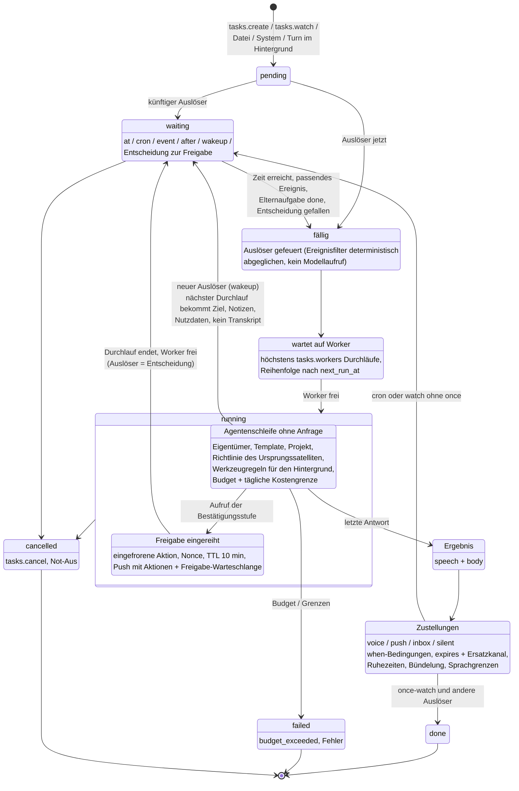

```mermaid
%% Marshal: Lebenszyklus einer Aufgabe (deutsche Fassung von task-lifecycle.md)
%% KEEP UP TO DATE: must match the task system, event bus, approval queue and task delivery (task-system, event-bus,
%% approval-queue, task-delivery specs). Update it together with task-lifecycle.md in the same change (see docs/diagrams/README.md).
stateDiagram-v2
    state "pending" as Pending
    state "waiting" as Waiting
    Waiting: at / cron / event / after / wakeup /<br/>Entscheidung zur Freigabe
    state "fällig" as Due
    Due: Auslöser gefeuert (Ereignisfilter deterministisch<br/>abgeglichen, kein Modellaufruf)
    state "wartet auf Worker" as Queued
    Queued: höchstens tasks.workers Durchläufe,<br/>Reihenfolge nach next_run_at
    state "running" as Running {
        state "Agentenschleife ohne Anfrage" as Loop
        Loop: Eigentümer, Template, Projekt,<br/>Richtlinie des Ursprungssatelliten,<br/>Werkzeugregeln für den Hintergrund,<br/>Budget + tägliche Kostengrenze
        state "Freigabe eingereiht" as Approval
        Approval: eingefrorene Aktion, Nonce, TTL 10 min,<br/>Push mit Aktionen + Freigabe-Warteschlange
        Loop --> Approval: Aufruf der Bestätigungsstufe
    }
    state "Ergebnis" as Result
    Result: speech + body
    state "Zustellungen" as Deliveries
    Deliveries: voice / push / inbox / silent<br/>when-Bedingungen, expires + Ersatzkanal,<br/>Ruhezeiten, Bündelung, Sprachgrenzen
    state "done" as Done
    state "failed" as Failed
    Failed: budget_exceeded, Fehler
    state "cancelled" as Cancelled
    Cancelled: tasks.cancel, Not-Aus

    [*] --> Pending: tasks.create / tasks.watch /<br/>Datei / System / Turn im Hintergrund
    Pending --> Waiting: künftiger Auslöser
    Pending --> Due: Auslöser jetzt
    Waiting --> Due: Zeit erreicht, passendes Ereignis,<br/>Elternaufgabe done, Entscheidung gefallen
    Due --> Queued
    Queued --> Running: Worker frei
    Approval --> Waiting: Durchlauf endet, Worker frei<br/>(Auslöser = Entscheidung)
    Loop --> Waiting: neuer Auslöser (wakeup)<br/>nächster Durchlauf bekommt Ziel, Notizen,<br/>Nutzdaten, kein Transkript
    Loop --> Result: letzte Antwort
    Loop --> Failed: Budget / Grenzen
    Result --> Deliveries
    Deliveries --> Waiting: cron oder watch ohne once
    Deliveries --> Done: once-watch und andere Auslöser
    Running --> Cancelled
    Waiting --> Cancelled
    Done --> [*]
    Failed --> [*]
    Cancelled --> [*]
```
