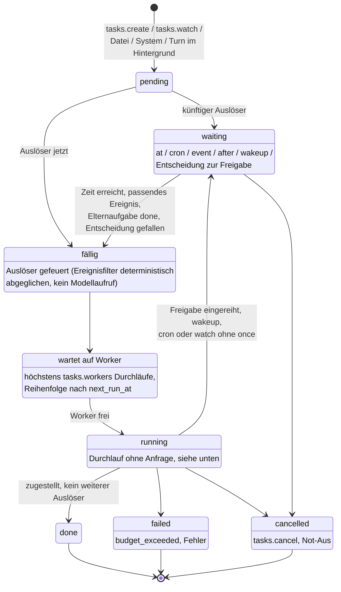

```mermaid
stateDiagram-v2
%% Marshal: Lebenszyklus einer Aufgabe (deutsche Fassung von task-lifecycle.md)
%% KEEP UP TO DATE: must match the task system, event bus and approval queue (task-system, event-bus, approval-queue
%% specs). Update it together with task-lifecycle.md in the same change (see docs/diagrams/README.md).
    state "pending" as Pending
    state "waiting" as Waiting
    Waiting: at / cron / event / after / wakeup /<br/>Entscheidung zur Freigabe
    state "fällig" as Due
    Due: Auslöser gefeuert (Ereignisfilter deterministisch<br/>abgeglichen, kein Modellaufruf)
    state "wartet auf Worker" as Queued
    Queued: höchstens tasks.workers Durchläufe,<br/>Reihenfolge nach next_run_at
    state "running" as Running
    Running: Durchlauf ohne Anfrage, siehe unten
    state "done" as Done
    state "failed" as Failed
    Failed: budget_exceeded, Fehler
    state "cancelled" as Cancelled
    Cancelled: tasks.cancel, Not-Aus

    [*] --> Pending: tasks.create / tasks.watch /<br/>Datei / System / Turn im Hintergrund
    Pending --> Waiting: künftiger Auslöser
    Pending --> Due: Auslöser jetzt
    Waiting --> Due: Zeit erreicht, passendes Ereignis,<br/>Elternaufgabe done, Entscheidung gefallen
    Due --> Queued
    Queued --> Running: Worker frei
    Running --> Waiting: Freigabe eingereiht, wakeup,<br/>cron oder watch ohne once
    Running --> Done: zugestellt, kein weiterer Auslöser
    Running --> Failed
    Running --> Cancelled
    Waiting --> Cancelled
    Done --> [*]
    Failed --> [*]
    Cancelled --> [*]
```
