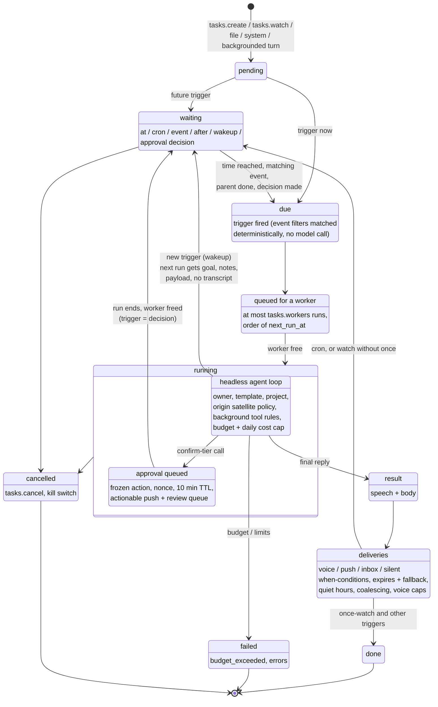

```mermaid
%% Marshal: task lifecycle
%% KEEP UP TO DATE: must match the task system, event bus, approval queue and task delivery (task-system, event-bus,
%% approval-queue, task-delivery specs). Update it in the same change that alters them (see docs/diagrams/README.md).
stateDiagram-v2
    state "pending" as Pending
    state "waiting" as Waiting
    Waiting: at / cron / event / after / wakeup /<br/>approval decision
    state "due" as Due
    Due: trigger fired (event filters matched<br/>deterministically, no model call)
    state "queued for a worker" as Queued
    Queued: at most tasks.workers runs,<br/>order of next_run_at
    state "running" as Running {
        state "headless agent loop" as Loop
        Loop: owner, template, project,<br/>origin satellite policy,<br/>background tool rules,<br/>budget + daily cost cap
        state "approval queued" as Approval
        Approval: frozen action, nonce, 10 min TTL,<br/>actionable push + review queue
        Loop --> Approval: confirm-tier call
    }
    state "result" as Result
    Result: speech + body
    state "deliveries" as Deliveries
    Deliveries: voice / push / inbox / silent<br/>when-conditions, expires + fallback,<br/>quiet hours, coalescing, voice caps
    state "done" as Done
    state "failed" as Failed
    Failed: budget_exceeded, errors
    state "cancelled" as Cancelled
    Cancelled: tasks.cancel, kill switch

    [*] --> Pending: tasks.create / tasks.watch /<br/>file / system / backgrounded turn
    Pending --> Waiting: future trigger
    Pending --> Due: trigger now
    Waiting --> Due: time reached, matching event,<br/>parent done, decision made
    Due --> Queued
    Queued --> Running: worker free
    Approval --> Waiting: run ends, worker freed<br/>(trigger = decision)
    Loop --> Waiting: new trigger (wakeup)<br/>next run gets goal, notes,<br/>payload, no transcript
    Loop --> Result: final reply
    Loop --> Failed: budget / limits
    Result --> Deliveries
    Deliveries --> Waiting: cron, or watch without once
    Deliveries --> Done: once-watch and other triggers
    Running --> Cancelled
    Waiting --> Cancelled
    Done --> [*]
    Failed --> [*]
    Cancelled --> [*]
```
