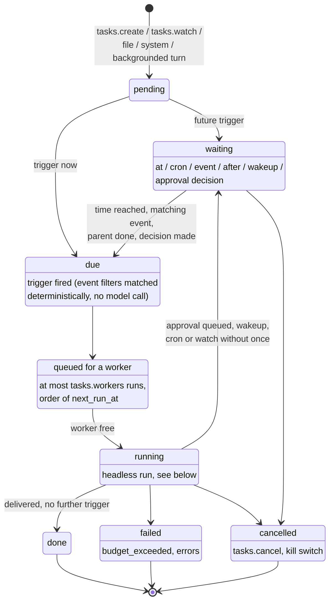

```mermaid
stateDiagram-v2
%% Marshal: task lifecycle
%% KEEP UP TO DATE: must match the task system, event bus and approval queue (task-system, event-bus, approval-queue
%% specs). Update it together with task-lifecycle.de.md in the same change (see docs/diagrams/README.md).
    state "pending" as Pending
    state "waiting" as Waiting
    Waiting: at / cron / event / after / wakeup /<br/>approval decision
    state "due" as Due
    Due: trigger fired (event filters matched<br/>deterministically, no model call)
    state "queued for a worker" as Queued
    Queued: at most tasks.workers runs,<br/>order of next_run_at
    state "running" as Running
    Running: headless run, see below
    state "done" as Done
    state "failed" as Failed
    Failed: budget_exceeded, errors
    state "cancelled" as Cancelled
    Cancelled: tasks.cancel, kill switch

    [*] --> Pending: tasks.create / tasks.watch /<br/>file / system / backgrounded turn
    Pending --> Waiting: future trigger
    Pending --> Due: trigger now
    Waiting --> Due: time reached, matching event,<br/>parent done, decision made
    Due --> Queued
    Queued --> Running: worker free
    Running --> Waiting: approval queued, wakeup,<br/>cron or watch without once
    Running --> Done: delivered, no further trigger
    Running --> Failed
    Running --> Cancelled
    Waiting --> Cancelled
    Done --> [*]
    Failed --> [*]
    Cancelled --> [*]
```
