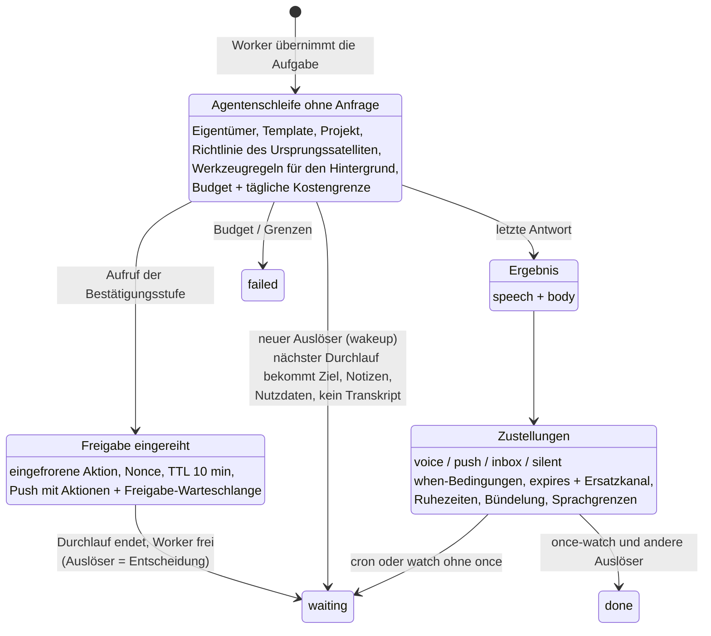

```mermaid
stateDiagram-v2
%% Marshal: Innerhalb eines Aufgabenlaufs (deutsche Fassung von task-run.md)
%% KEEP UP TO DATE: must match the headless agent loop of a task, the approval queue and task delivery (task-system,
%% approval-queue, task-delivery specs). Update it together with task-run.md in the same change (see
%% docs/diagrams/README.md).
    state "Agentenschleife ohne Anfrage" as Loop
    Loop: Eigentümer, Template, Projekt,<br/>Richtlinie des Ursprungssatelliten,<br/>Werkzeugregeln für den Hintergrund,<br/>Budget + tägliche Kostengrenze
    state "Freigabe eingereiht" as Approval
    Approval: eingefrorene Aktion, Nonce, TTL 10 min,<br/>Push mit Aktionen + Freigabe-Warteschlange
    state "Ergebnis" as Result
    Result: speech + body
    state "Zustellungen" as Deliveries
    Deliveries: voice / push / inbox / silent<br/>when-Bedingungen, expires + Ersatzkanal,<br/>Ruhezeiten, Bündelung, Sprachgrenzen
    state "waiting" as Waiting
    state "done" as Done
    state "failed" as Failed

    [*] --> Loop: Worker übernimmt die Aufgabe
    Loop --> Approval: Aufruf der Bestätigungsstufe
    Approval --> Waiting: Durchlauf endet, Worker frei<br/>(Auslöser = Entscheidung)
    Loop --> Waiting: neuer Auslöser (wakeup)<br/>nächster Durchlauf bekommt Ziel, Notizen,<br/>Nutzdaten, kein Transkript
    Loop --> Result: letzte Antwort
    Loop --> Failed: Budget / Grenzen
    Result --> Deliveries
    Deliveries --> Waiting: cron oder watch ohne once
    Deliveries --> Done: once-watch und andere Auslöser
```
