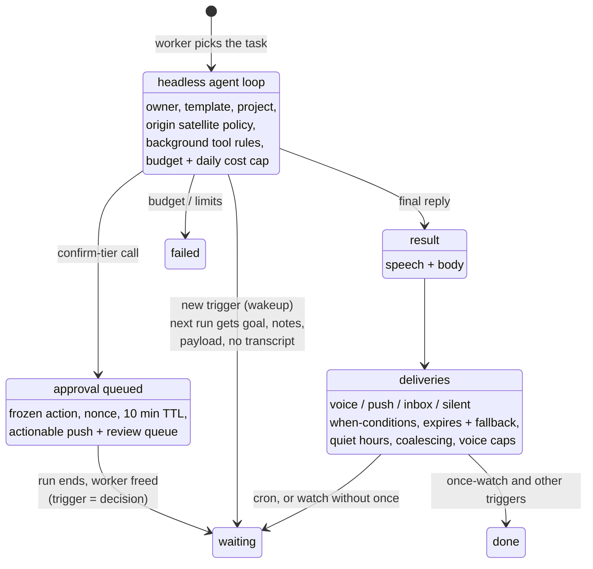

```mermaid
stateDiagram-v2
%% Marshal: inside a task run
%% KEEP UP TO DATE: must match the headless agent loop of a task, the approval queue and task delivery (task-system,
%% approval-queue, task-delivery specs). Update it together with task-run.de.md in the same change (see
%% docs/diagrams/README.md).
    state "headless agent loop" as Loop
    Loop: owner, template, project,<br/>origin satellite policy,<br/>background tool rules,<br/>budget + daily cost cap
    state "approval queued" as Approval
    Approval: frozen action, nonce, 10 min TTL,<br/>actionable push + review queue
    state "result" as Result
    Result: speech + body
    state "deliveries" as Deliveries
    Deliveries: voice / push / inbox / silent<br/>when-conditions, expires + fallback,<br/>quiet hours, coalescing, voice caps
    state "waiting" as Waiting
    state "done" as Done
    state "failed" as Failed

    [*] --> Loop: worker picks the task
    Loop --> Approval: confirm-tier call
    Approval --> Waiting: run ends, worker freed<br/>(trigger = decision)
    Loop --> Waiting: new trigger (wakeup)<br/>next run gets goal, notes,<br/>payload, no transcript
    Loop --> Result: final reply
    Loop --> Failed: budget / limits
    Result --> Deliveries
    Deliveries --> Waiting: cron, or watch without once
    Deliveries --> Done: once-watch and other triggers
```
