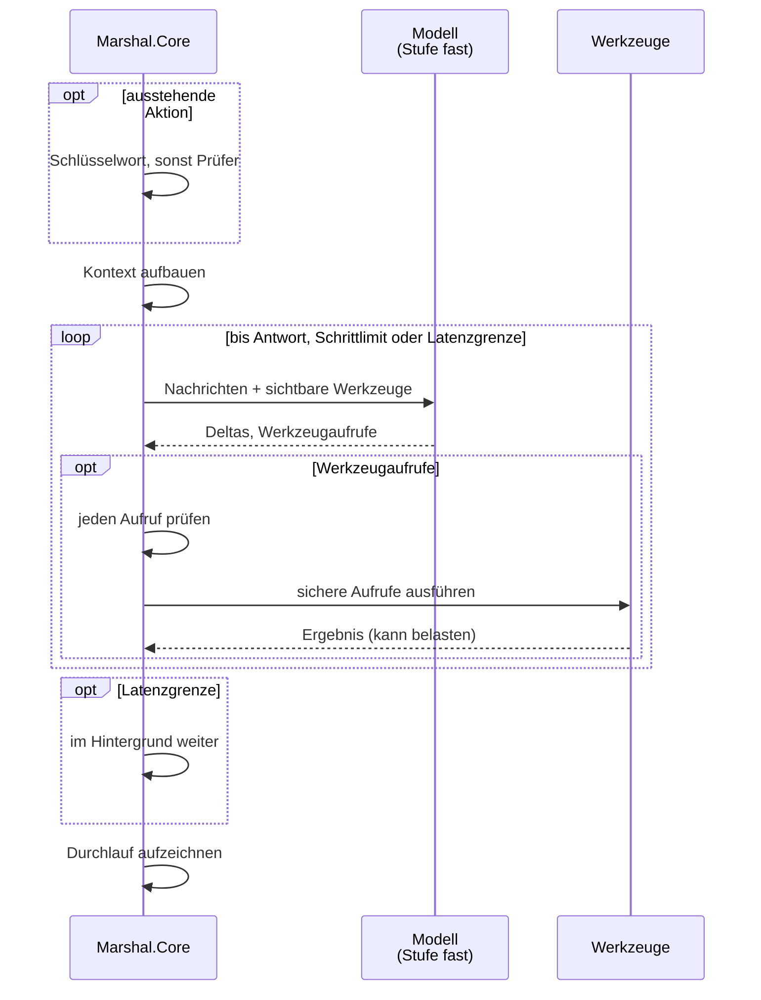

```mermaid
sequenceDiagram
%% Marshal: Sprach-Turn, Agentenschleife (deutsche Fassung von voice-turn-agent-loop.md)
%% KEEP UP TO DATE: must match the agent loop of a conversation turn (confirmation check, context builder, visibility
%% filter, guard, latency cap). Update it together with voice-turn-agent-loop.md in the same change (see
%% docs/diagrams/README.md).
%% Keep every message on one short line: the site draws sequence diagrams at build time, and multi-line labels overlap.
    participant Core as Marshal.Core
    participant Model as Modell<br/>(Stufe fast)
    participant Tools as Werkzeuge

    opt ausstehende Aktion
        Core->>Core: Schlüsselwort, sonst Prüfer
    end
    Core->>Core: Kontext aufbauen
    loop bis Antwort, Schrittlimit oder Latenzgrenze
        Core->>Model: Nachrichten + sichtbare Werkzeuge
        Model-->>Core: Deltas, Werkzeugaufrufe
        opt Werkzeugaufrufe
            Core->>Core: jeden Aufruf prüfen
            Core->>Tools: sichere Aufrufe ausführen
            Tools-->>Core: Ergebnis (kann belasten)
        end
    end
    opt Latenzgrenze
        Core->>Core: im Hintergrund weiter
    end
    Core->>Core: Durchlauf aufzeichnen
```
