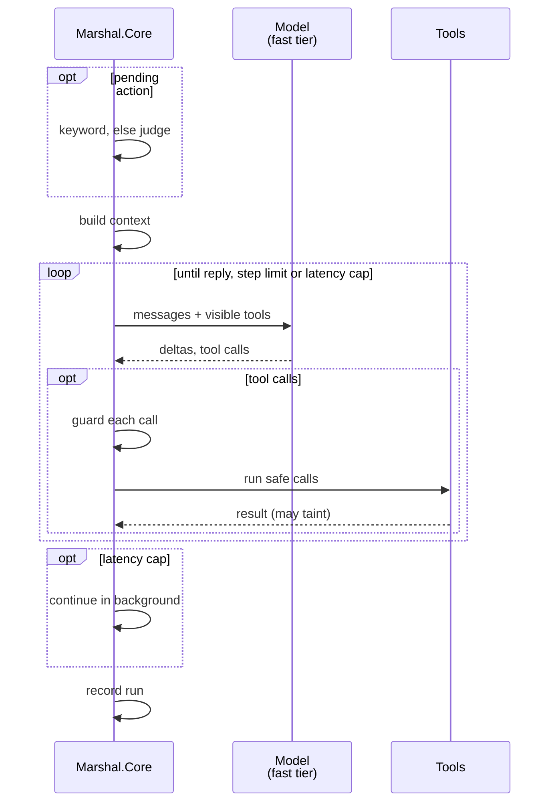

```mermaid
sequenceDiagram
%% Marshal: voice turn, agent loop
%% KEEP UP TO DATE: must match the agent loop of a conversation turn (confirmation check, context builder, visibility
%% filter, guard, latency cap). Update it together with voice-turn-agent-loop.de.md in the same change (see
%% docs/diagrams/README.md).
%% Keep every message on one short line: the site draws sequence diagrams at build time, and multi-line labels overlap.
    participant Core as Marshal.Core
    participant Model as Model<br/>(fast tier)
    participant Tools

    opt pending action
        Core->>Core: keyword, else judge
    end
    Core->>Core: build context
    loop until reply, step limit or latency cap
        Core->>Model: messages + visible tools
        Model-->>Core: deltas, tool calls
        opt tool calls
            Core->>Core: guard each call
            Core->>Tools: run safe calls
            Tools-->>Core: result (may taint)
        end
    end
    opt latency cap
        Core->>Core: continue in background
    end
    Core->>Core: record run
```
