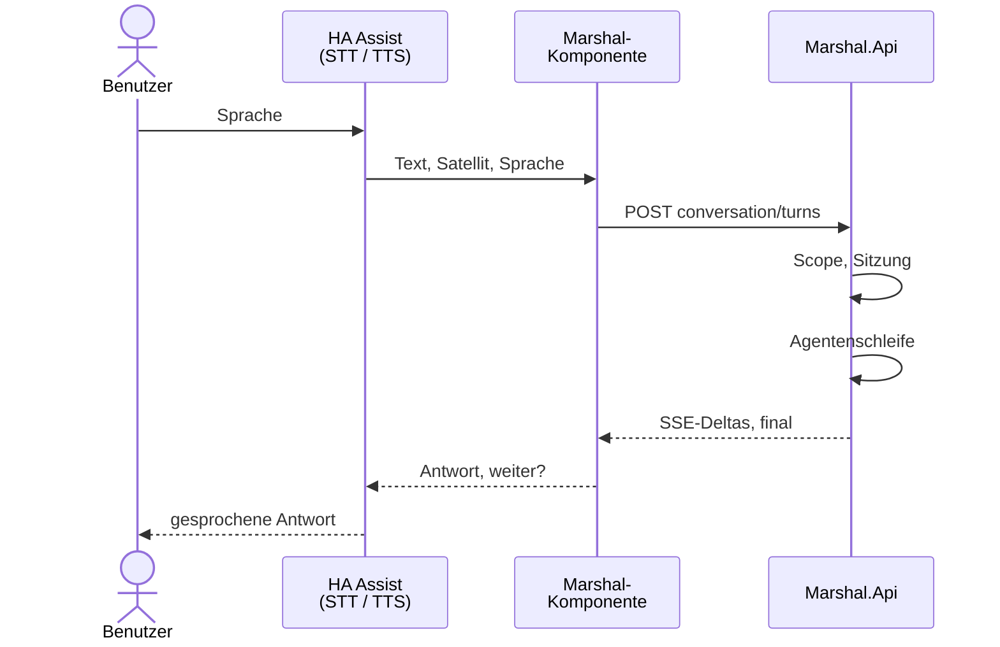

```mermaid
sequenceDiagram
%% Marshal: Sprach-Turn, Weg der Anfrage (deutsche Fassung von voice-turn-request.md)
%% KEEP UP TO DATE: must match the conversation turn path (ha/ custom component, POST /api/v1/conversation/turns,
%% SSE). Update it together with voice-turn-request.md in the same change (see docs/diagrams/README.md).
%% Keep every message on one short line: the site draws sequence diagrams at build time, and multi-line labels overlap.
    actor User as Benutzer
    participant Assist as HA Assist<br/>(STT / TTS)
    participant Comp as Marshal-<br/>Komponente
    participant Api as Marshal.Api

    User->>Assist: Sprache
    Assist->>Comp: Text, Satellit, Sprache
    Comp->>Api: POST conversation/turns
    Api->>Api: Scope, Sitzung
    Api->>Api: Agentenschleife
    Api-->>Comp: SSE-Deltas, final
    Comp-->>Assist: Antwort, weiter?
    Assist-->>User: gesprochene Antwort
```
