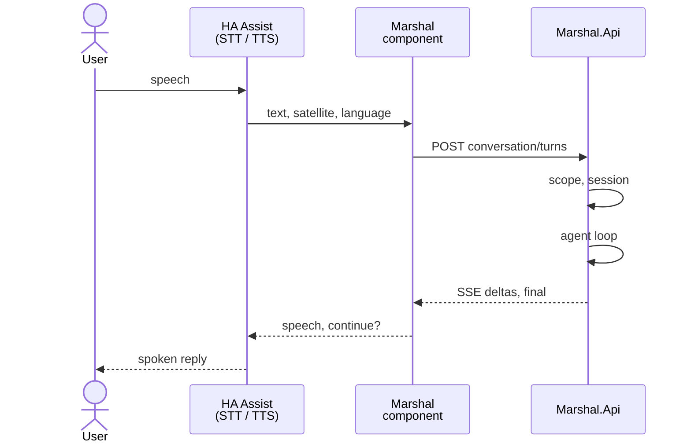

```mermaid
sequenceDiagram
%% Marshal: voice turn, request path
%% KEEP UP TO DATE: must match the conversation turn path (ha/ custom component, POST /api/v1/conversation/turns,
%% SSE). Update it together with voice-turn-request.de.md in the same change (see docs/diagrams/README.md).
%% Keep every message on one short line: the site draws sequence diagrams at build time, and multi-line labels overlap.
    actor User
    participant Assist as HA Assist<br/>(STT / TTS)
    participant Comp as Marshal<br/>component
    participant Api as Marshal.Api

    User->>Assist: speech
    Assist->>Comp: text, satellite, language
    Comp->>Api: POST conversation/turns
    Api->>Api: scope, session
    Api->>Api: agent loop
    Api-->>Comp: SSE deltas, final
    Comp-->>Assist: speech, continue?
    Assist-->>User: spoken reply
```
