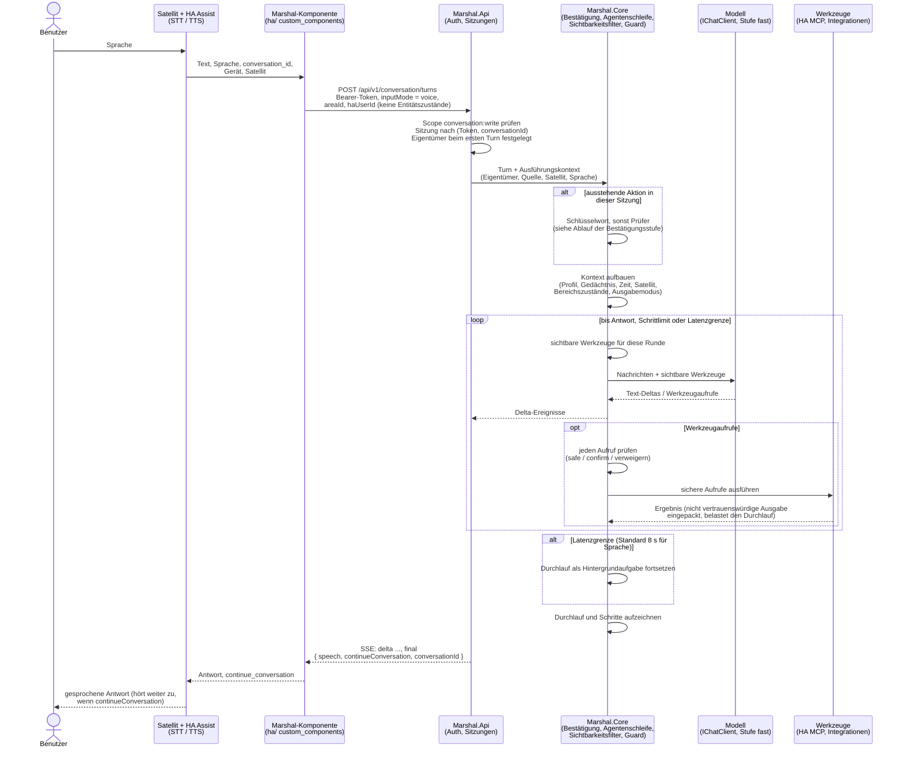

```mermaid
%% Marshal: Ablauf eines Sprach-Turns (deutsche Fassung von voice-turn.md)
%% KEEP UP TO DATE: must match the conversation turn path (ha/ custom component, POST /api/v1/conversation/turns,
%% agent loop, SSE). Update it together with voice-turn.md in the same change (see docs/diagrams/README.md).
sequenceDiagram
    actor User as Benutzer
    participant Assist as Satellit + HA Assist<br/>(STT / TTS)
    participant Comp as Marshal-Komponente<br/>(ha/ custom_components)
    participant Api as Marshal.Api<br/>(Auth, Sitzungen)
    participant Core as Marshal.Core<br/>(Bestätigung, Agentenschleife,<br/>Sichtbarkeitsfilter, Guard)
    participant Model as Modell<br/>(IChatClient, Stufe fast)
    participant Tools as Werkzeuge<br/>(HA MCP, Integrationen)

    User->>Assist: Sprache
    Assist->>Comp: Text, Sprache, conversation_id,<br/>Gerät, Satellit
    Comp->>Api: POST /api/v1/conversation/turns<br/>Bearer-Token, inputMode = voice,<br/>areaId, haUserId (keine Entitätszustände)
    Api->>Api: Scope conversation:write prüfen<br/>Sitzung nach (Token, conversationId)<br/>Eigentümer beim ersten Turn festgelegt
    Api->>Core: Turn + Ausführungskontext<br/>(Eigentümer, Quelle, Satellit, Sprache)

    alt ausstehende Aktion in dieser Sitzung
        Core->>Core: Schlüsselwort, sonst Prüfer<br/>(siehe Ablauf der Bestätigungsstufe)
    end

    Core->>Core: Kontext aufbauen<br/>(Profil, Gedächtnis, Zeit, Satellit,<br/>Bereichszustände, Ausgabemodus)
    loop bis Antwort, Schrittlimit oder Latenzgrenze
        Core->>Core: sichtbare Werkzeuge für diese Runde
        Core->>Model: Nachrichten + sichtbare Werkzeuge
        Model-->>Core: Text-Deltas / Werkzeugaufrufe
        Core-->>Api: Delta-Ereignisse
        opt Werkzeugaufrufe
            Core->>Core: jeden Aufruf prüfen<br/>(safe / confirm / verweigern)
            Core->>Tools: sichere Aufrufe ausführen
            Tools-->>Core: Ergebnis (nicht vertrauenswürdige Ausgabe<br/>eingepackt, belastet den Durchlauf)
        end
    end

    alt Latenzgrenze (Standard 8 s für Sprache)
        Core->>Core: Durchlauf als Hintergrundaufgabe fortsetzen
    end

    Core->>Core: Durchlauf und Schritte aufzeichnen
    Api-->>Comp: SSE: delta ..., final<br/>{ speech, continueConversation, conversationId }
    Comp-->>Assist: Antwort, continue_conversation
    Assist-->>User: gesprochene Antwort (hört weiter zu,<br/>wenn continueConversation)
```
