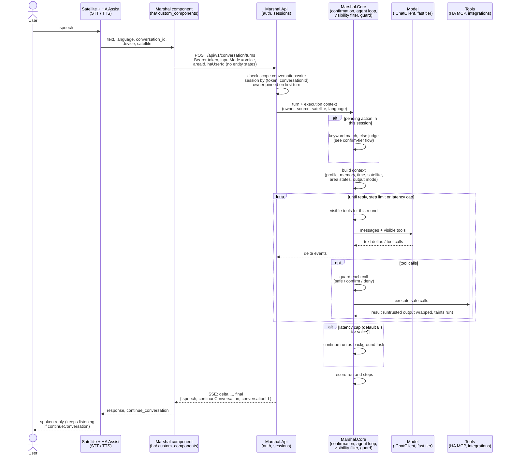

```mermaid
%% Marshal: voice turn request flow
%% KEEP UP TO DATE: must match the conversation turn path (ha/ custom component, POST /api/v1/conversation/turns,
%% agent loop, SSE). Update it in the same change that alters that path (see docs/diagrams/README.md).
sequenceDiagram
    actor User
    participant Assist as Satellite + HA Assist<br/>(STT / TTS)
    participant Comp as Marshal component<br/>(ha/ custom_components)
    participant Api as Marshal.Api<br/>(auth, sessions)
    participant Core as Marshal.Core<br/>(confirmation, agent loop,<br/>visibility filter, guard)
    participant Model as Model<br/>(IChatClient, fast tier)
    participant Tools as Tools<br/>(HA MCP, integrations)

    User->>Assist: speech
    Assist->>Comp: text, language, conversation_id,<br/>device, satellite
    Comp->>Api: POST /api/v1/conversation/turns<br/>Bearer token, inputMode = voice,<br/>areaId, haUserId (no entity states)
    Api->>Api: check scope conversation:write<br/>session by (token, conversationId)<br/>owner pinned on first turn
    Api->>Core: turn + execution context<br/>(owner, source, satellite, language)

    alt pending action in this session
        Core->>Core: keyword match, else judge<br/>(see confirm-tier flow)
    end

    Core->>Core: build context<br/>(profile, memory, time, satellite,<br/>area states, output mode)
    loop until reply, step limit or latency cap
        Core->>Core: visible tools for this round
        Core->>Model: messages + visible tools
        Model-->>Core: text deltas / tool calls
        Core-->>Api: delta events
        opt tool calls
            Core->>Core: guard each call<br/>(safe / confirm / deny)
            Core->>Tools: execute safe calls
            Tools-->>Core: result (untrusted output wrapped, taints run)
        end
    end

    alt latency cap (default 8 s for voice)
        Core->>Core: continue run as background task
    end

    Core->>Core: record run and steps
    Api-->>Comp: SSE: delta ..., final<br/>{ speech, continueConversation, conversationId }
    Comp-->>Assist: response, continue_conversation
    Assist-->>User: spoken reply (keeps listening<br/>if continueConversation)
```
